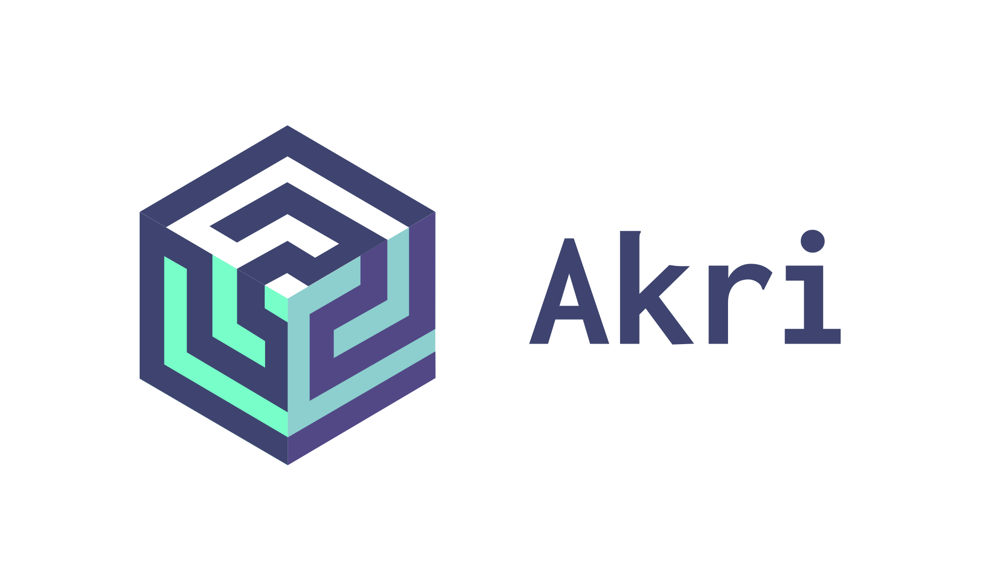

 
 
 
 

 
 
 

----
Akri lets you easily expose heterogeneous leaf devices (such as IP cameras and USB devices) as resources in a Kubernetes cluster, while also supporting the exposure of embedded hardware resources such as GPUs and FPGAs. Akri continually detects nodes that have access to these devices and schedules workloads based on them. 

Simply put: you name it, Akri finds it, you use it.

----
## Why Akri
At the edge, there are a variety of sensors, controllers, and MCU class devices that are producing data and performing actions. For Kubernetes to be a viable edge computing solution, these heterogeneous “leaf devices” need to be easily utilized by Kubernetes clusters. However, many of these leaf devices are too small to run Kubernetes themselves. Akri is an open source project that exposes these leaf devices as resources in a Kubernetes cluster. It leverages and extends the Kubernetes [device plugin framework](https://kubernetes.io/docs/concepts/extend-kubernetes/compute-storage-net/device-plugins/), which was created with the cloud in mind and focuses on advertising static resources such as GPUs and other system hardware. Akri took this framework and applied it to the edge, where there is a diverse set of leaf devices with unique communication protocols and intermittent availability.   

Akri is made for the edge, **handling the dynamic appearance and disappearance of leaf devices**. Akri provides an abstraction layer similar to [CNI](https://github.com/containernetworking/cni), but instead of abstracting the underlying network details, it is removing the work of finding, utilizing, and monitoring the availability of the leaf device. An operator simply has to apply a Akri Configuration to a cluster, specifying the discovery protocol (say ONVIF) and the pod that should be deployed upon discovery (say a video frame server). Then, Akri does the rest. An operator can also allow multiple nodes to utilize a leaf device, thereby **providing high availability** in the case where a node goes offline. Furthermore, Akri will automatically create a Kubernetes service for each type of leaf device (or Akri Configuration), removing the need for an application to track the state of pods or nodes.

Most importantly, Akri **was built to be extensible**. We currently have ONVIF, udev, and OPC UA discovery handlers, but more can be easily added by community members like you. The more protocols Akri can support, the wider an array of leaf devices Akri can discover. We are excited to work with you to build a more connected edge.

## How Akri Works
Akri’s architecture is made up of four key components: two custom resources, a device plugin implementation, and a custom controller. The first custom resource, the Akri Configuration, is where **you name it**. This tells Akri what kind of device it should look for. At this point, **Akri finds it**! Akri's device plugin implementation looks for the device and tracks its availability using Akri's second custom resource, the Akri Instance. Having found your device, the Akri Controller helps **you use it**. It sees each Akri Instance (which represents a leaf device) and deploys a ("broker") pod that knows how to connect to the resource and utilize it.

## Quick Start with a Demo
Try the [end to end demo](./docs/end-to-end-demo.md) of Akri to see Akri discover mock video cameras and a streaming app display the footage from those cameras. It includes instructions on K8s cluster setup. If you would like to perform the demo on a cluster of Raspberry Pi 4's, see the [Raspberry Pi 4 demo](./docs/end-to-end-demo-rpi4.md).

## Documentation
- [Running Akri using our currently supported protocols](./docs/user-guide.md) 
- [Akri architecture in depth](./docs/architecture.md)
- [How to build Akri](./docs/development.md)
- [How to extend Akri for protocols that haven't been supported yet](./docs/extensibility.md).
- Proposals for enhancements such as new protocol implementations can be found in the [proposals folder](./docs/proposals)

## Roadmap
Akri was built to be extensible. We currently have ONVIF, udev, OPC UA discovery handlers, but as a community, we hope to continuously support more protocols. We have created a [discovery handler implementation roadmap](./docs/roadmap.md#implement-additional-discovery-handlers) in order to prioritize development of discovery handlers. If there is a protocol you feel we should prioritize, please [create an issue](https://github.com/deislabs/akri/issues/new/choose), or better yet, contribute the implementation! We are excited to work with you to build a more connected edge.

## Contributing
This project welcomes contributions, whether by [creating new issues](https://github.com/deislabs/akri/issues/new/choose) or pull requests. See our [contributing document](./docs/contributing.md) on how to get started.

## Licensing
This project is released under the [MIT License](./LICENSE).
