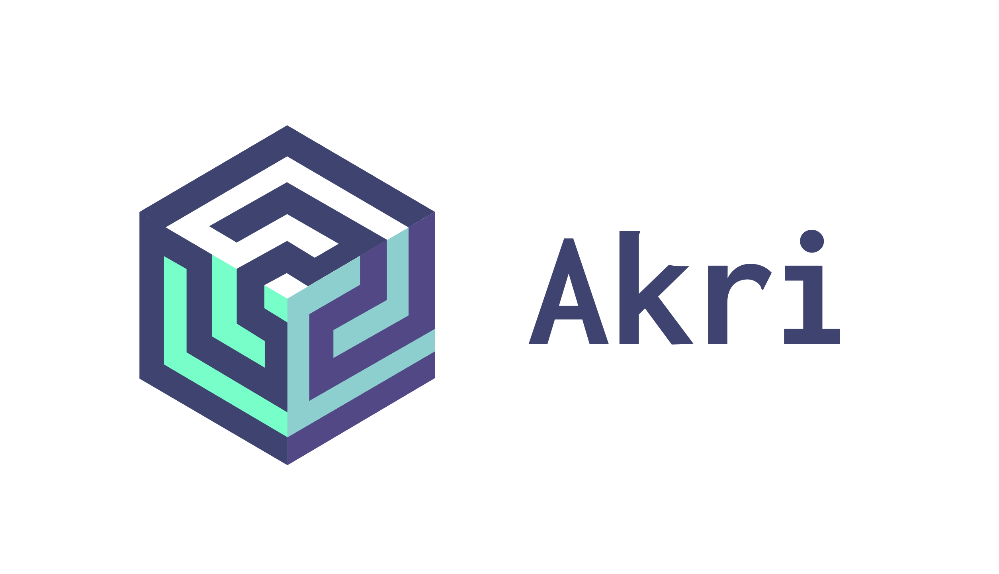

# Home

## What is Akri?

Akri is a Kubernetes Resource that lets you easily expose heterogeneous leaf devices \(such as IP cameras and USB devices\) as resources in a Kubernetes cluster, while also supporting the exposure of embedded hardware resources such as GPUs and FPGAs. Akri continually detects nodes that have access to these devices and schedules workloads based on them.

Simply put: you name it, Akri finds it, you use it.

## Why Akri?

At the edge, there are a variety of sensors, controllers, and MCU class devices that are producing data and performing actions. For Kubernetes to be a viable edge computing solution, these heterogeneous “leaf devices” need to be easily utilized by Kubernetes clusters. However, many of these leaf devices are too small to run Kubernetes themselves. Akri is an open source project that exposes these leaf devices as resources in a Kubernetes cluster. It leverages and extends the Kubernetes [device plugin framework](https://kubernetes.io/docs/concepts/extend-kubernetes/compute-storage-net/device-plugins/), which was created with the cloud in mind and focuses on advertising static resources such as GPUs and other system hardware. Akri took this framework and applied it to the edge, where there is a diverse set of leaf devices with unique communication protocols and intermittent availability.

Akri is made for the edge, **handling the dynamic appearance and disappearance of leaf devices**. Akri provides an abstraction layer similar to [CNI](https://github.com/containernetworking/cni), but instead of abstracting the underlying network details, it is removing the work of finding, utilizing, and monitoring the availability of the leaf device. An operator simply has to apply a Akri Configuration to a cluster, specifying the Discovery Handler \(say ONVIF\) that should be used to discover the devices and the Pod that should be deployed upon discovery \(say a video frame server\). Then, Akri does the rest. An operator can also allow multiple nodes to utilize a leaf device, thereby **providing high availability** in the case where a node goes offline. Furthermore, Akri will automatically create a Kubernetes service for each type of leaf device \(or Akri Configuration\), removing the need for an application to track the state of pods or nodes.

Most importantly, Akri **was built to be extensible**. Akri currently supports ONVIF, udev, and OPC UA Discovery Handlers, but more can be easily added by community members like you. The more protocols Akri can support, the wider an array of leaf devices Akri can discover. We are excited to work with you to build a more connected edge.

