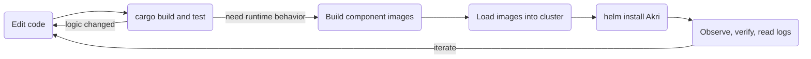

# Developer Guide: Building and Testing Akri Locally

So you've made a change to Akri and you want to see it actually work. This guide walks you
from a fresh checkout to watching Akri discover a device and stand up a broker for it on a
real cluster — all on your own machine.

The thing to understand up front is that testing Akri is a layered activity, and most of
the time you don't need the whole stack. A change to discovery logic or a controller
reconcile path is usually proven fastest with `cargo` alone. You only reach for container
images and a cluster when you need to watch the Agent, Controller, and Discovery Handlers
behave together at runtime. The guide follows that same order — cheapest and fastest first,
heaviest last — so you can stop at whatever layer answers your question.



We'll cover two worked examples once the machinery is in place. **debug-echo** is a
synthetic discovery handler that invents devices out of thin air, so it needs no hardware
and is the quickest way to confirm the whole discovery-to-broker pipeline is alive. The
**udev webcam** example is the real thing: discovering `/dev/video*` devices and serving
their frames over gRPC, with a little web app to watch the video.

## What you'll need

You'll want a Rust toolchain matching the workspace's `rust-version` in the root
`Cargo.toml` (currently **1.88**). There's no `rust-toolchain.toml` in the repo, so nothing
pins it automatically — make sure your default toolchain is at least that, e.g.
`rustup default 1.88` or newer. For the cluster work you'll need Docker with the `buildx`
plugin, plus `kubectl` and Helm v3. The `LOAD=1` image builds in this guide are
single-architecture and work with the stock buildx setup; you'd only need a dedicated
`docker-container` builder (`docker buildx create --use`) for multi-arch builds, which we
don't do here.

The cluster itself deserves a moment of thought. Any single-node Kubernetes will do, but
for the udev example it matters *which* kind: the Discovery Handler enumerates devices
through libudev and `/sys`, so the kubelet has to see the host's real `/dev`. A
host-level distribution like K3s, MicroK8s, or kubeadm gives you that. **kind and k3d run
the kubelet inside a container**, where it can't see your host's `/dev/video*` reliably —
they're perfectly fine for debug-echo, but reach for a host-level cluster when real
devices are involved.

## The fastest loop: cargo, no cluster

Before building anything, lean on the compiler and the test suite. Run `cargo` from the
workspace root — don't `cd` into a sub-crate; scope with `-p` instead.

```bash
cargo build --workspace
cargo test  --workspace          # or narrow it: cargo test -p agent
cargo clippy --workspace --all-targets
cargo fmt --all -- --check
```

This catches more than you might expect. The `akri-discovery-utils` tests stand up real
Unix-domain-socket gRPC servers and clients, so anything you've touched in the
control-plane plumbing gets exercised here — long before a cluster is involved. If your
change is self-contained, you may well be done at this layer.

## Building the component images

When you do need runtime behavior, the next step is turning your code into container
images. Akri's image builds live in `build/akri-containers.mk` (pulled in by the root
`Makefile`), and each one compiles the workspace inside `build/containers/Dockerfile.rust`
and tags an image. There's a target per component:

```bash
make akri-agent
make akri-controller
make akri-udev-discovery-handler
make akri-debug-echo-discovery-handler
# ...and onvif/opcua handlers, the webhook, and so on — see build/akri-containers.mk:7
```

By default these targets build for several architectures and expect to push to a registry,
which isn't what you want locally. Three variables fix that. Setting `LOAD=1` loads the
result straight into your local Docker daemon (and, since you can only load one
architecture at a time, pins the build to your host's). `PREFIX` replaces the registry
prefix with a name of your choosing, and `LABEL_PREFIX` sets the tag — worth pinning to
something stable like `dev`, because the default is a timestamped string that changes every
build and would force you to keep editing your Helm values. If you'd rather trade an
optimized build for a faster one while iterating, add `BUILD_RELEASE_FLAG=` (empty) to skip
`--release`.

Putting that together, here's a single command that builds everything the two examples need:

```bash
LOAD=1 PREFIX=akri LABEL_PREFIX=dev \
  make akri-agent akri-controller akri-udev-discovery-handler akri-debug-echo-discovery-handler
```

The resulting image names follow a simple rule — `PREFIX/component:LABEL_PREFIX`, with the
`-handler` suffix dropped — so the command above gives you:

| Target | Image |
| --- | --- |
| `akri-agent` | `akri/agent:dev` |
| `akri-controller` | `akri/controller:dev` |
| `akri-udev-discovery-handler` | `akri/udev-discovery:dev` |
| `akri-debug-echo-discovery-handler` | `akri/debug-echo-discovery:dev` |

One note on the Agent: by default it's "slim" and embeds no discovery handlers, which is
why you deploy handlers as separate DaemonSets (you'll see `<handler>.discovery.enabled`
below). If you'd rather embed the handlers in the Agent itself, that's the separate
*agent-full* build — run `AGENT_FEATURES="agent-full onvif-feat opcua-feat udev-feat" make
akri-agent-full`, which produces its own `PREFIX/agent-full:LABEL` image (so you'd point
`agent.image.repository` at `…/agent-full`). Watch out: plain `make akri-agent` always builds
the slim Agent regardless of `AGENT_FEATURES` — see `build/akri-containers.mk:9` for the
single-command alternative.

## A cluster to run on

If you don't already have a local cluster, K3s is the quickest to stand up. The one option
worth adding is `--write-kubeconfig-mode 644`, which makes K3s's kubeconfig readable by your
user so you don't need `sudo` for every `kubectl` call:

```bash
curl -sfL https://get.k3s.io | INSTALL_K3S_EXEC="--write-kubeconfig-mode 644" sh -
export KUBECONFIG=/etc/rancher/k3s/k3s.yaml
```

That `export` only affects the current shell. Example B has you open a second terminal for
the camera streams, and `kubectl` there will silently fall back to `~/.kube/config` unless
you re-export `KUBECONFIG` (or add it to your shell profile) — so set it again in any new
terminal.

Before you install anything, take ten seconds to confirm you're pointed at the right
cluster. This sounds pedantic, but if you have remote clusters in your kubeconfig, an
unqualified `kubectl` or `helm` command will happily target whichever context is current —
and "I deployed my test build to a remote cluster" is not a fun afternoon.

```bash
kubectl config current-context   # is this your LOCAL cluster?
kubectl get nodes
```

## Getting your images into the cluster

Here's a subtlety that trips people up: `LOAD=1` put your images in the *Docker* daemon, but
K3s doesn't use Docker — it has its own containerd image store. The two don't share images,
so you have to hand them over explicitly:

```bash
docker save akri/agent:dev akri/controller:dev \
            akri/udev-discovery:dev akri/debug-echo-discovery:dev \
  | sudo k3s ctr images import -
```

(On MicroK8s it's `microk8s ctr image import`; on kind, `kind load docker-image`.) Because
these images live only on the node and not in any registry, you'll tell Helm to use them
with `pullPolicy=Never` — otherwise the kubelet tries to pull from a registry and fails.

## Installing Akri with your images

Akri ships a Helm chart in `deployment/helm`, and installing your local build is a matter of
overlaying that chart's defaults with your image names. The keys all come from
`deployment/helm/values.yaml`. Here's the common base; each example below adds a few flags
for its discovery handler:

```bash
helm install akri ./deployment/helm \
  --set agent.image.repository=akri/agent \
  --set agent.image.tag=dev \
  --set agent.image.pullPolicy=Never \
  --set controller.image.repository=akri/controller \
  --set controller.image.tag=dev \
  --set controller.image.pullPolicy=Never \
  --set webhookConfiguration.enabled=false
```

That last line turns off the validating webhook, which is on by default and would otherwise
pull a published image you haven't built. Leave it off unless the webhook is the thing
you're testing — in which case build it (`make akri-webhook-configuration`) and point its
`webhookConfiguration.image.*` keys at your local copy too.

## Example A — debug-echo, no hardware required

Start here even if your goal is the webcam, because debug-echo proves the whole pipeline
works without any device to muddy the picture. It conjures two fake devices, `foo0` and
`foo1`, and in doing so exercises exactly the gRPC-over-Unix-socket paths between the Agent,
the Discovery Handler, and the kubelet that most discovery changes touch.

```bash
helm install akri ./deployment/helm \
  --set agent.image.repository=akri/agent --set agent.image.tag=dev --set agent.image.pullPolicy=Never \
  --set controller.image.repository=akri/controller --set controller.image.tag=dev --set controller.image.pullPolicy=Never \
  --set webhookConfiguration.enabled=false \
  --set agent.allowDebugEcho=true \
  --set debugEcho.discovery.enabled=true \
  --set debugEcho.discovery.image.repository=akri/debug-echo-discovery \
  --set debugEcho.discovery.image.tag=dev \
  --set debugEcho.discovery.image.pullPolicy=Never \
  --set debugEcho.configuration.enabled=true
```

A word on `agent.allowDebugEcho=true`: it's here for parity with the upstream demo, but it's
worth knowing what it actually does. It only gates the *embedded* debug-echo handler in an
`agent-full` build (by setting the `ENABLE_DEBUG_ECHO` env var). In this slim-Agent setup,
discovery is driven entirely by the standalone handler you turned on with
`debugEcho.discovery.enabled=true`, so the flag is effectively a no-op here — harmless to
leave in, but not what makes this work. The default Configuration is named `akri-debug-echo`
with a capacity of two and descriptions `foo0` and `foo1`, so the moment everything connects
you should see two Instances appear.

Watch it happen:

```bash
watch kubectl get pods,akric,akrii -o wide
```

You're looking for the Agent, Controller, and debug-echo Discovery Handler pods all
`Running`, a single Configuration from `kubectl get akric`, and — the payoff — **two**
Instances from `kubectl get akrii`. If they're there, discovery works end to end. It's
always worth a glance at the logs to confirm the Discovery Handler registered cleanly and
nothing is quietly erroring in a loop:

```bash
kubectl logs -l app.kubernetes.io/name=akri-agent --tail=100
kubectl logs -l app.kubernetes.io/name=akri-controller --tail=100
kubectl logs -l app.kubernetes.io/name=akri-debug-echo-discovery --tail=100
```

(The Discovery Handler runs as its own DaemonSet; in Example B below its label is
`app.kubernetes.io/name=akri-udev-discovery`.)

## Example B — the udev webcam

Now for the real thing. This example discovers video devices on the node and deploys a
broker that reads frames from each one and serves them over gRPC.

If you ran Example A, uninstall it first — both examples use the Helm release name `akri`,
and Helm won't let you install a second release with the same name. `helm uninstall akri`
clears it (its pre-delete hook removes the debug-echo Configuration for you).

First you need cameras. If you have real ones, `ls /dev/video*` and you're set. If not, you
can fake them convincingly with the `v4l2loopback` kernel module and feed each a GStreamer
test pattern (you'll want `gstreamer1.0-tools` and its plugins installed):

```bash
sudo modprobe v4l2loopback exclusive_caps=1 video_nr=1,2
sudo gst-launch-1.0 -v videotestsrc pattern=ball ! \
  "video/x-raw,width=640,height=480,framerate=10/1" ! avenc_mjpeg ! v4l2sink device=/dev/video1 &
sudo gst-launch-1.0 -v videotestsrc pattern=smpte horizontal-speed=1 ! \
  "video/x-raw,width=640,height=480,framerate=10/1" ! avenc_mjpeg ! v4l2sink device=/dev/video2 &
```

With cameras in place, install Akri pointed at the udev handler, and this time give it a
broker image so it does something with what it finds:

```bash
helm install akri ./deployment/helm \
  --set agent.image.repository=akri/agent --set agent.image.tag=dev --set agent.image.pullPolicy=Never \
  --set controller.image.repository=akri/controller --set controller.image.tag=dev --set controller.image.pullPolicy=Never \
  --set webhookConfiguration.enabled=false \
  --set udev.discovery.enabled=true \
  --set udev.discovery.image.repository=akri/udev-discovery \
  --set udev.discovery.image.tag=dev \
  --set udev.discovery.image.pullPolicy=Never \
  --set udev.configuration.enabled=true \
  --set udev.configuration.name=akri-udev-video \
  --set 'udev.configuration.discoveryDetails.udevRules[0]=KERNEL=="video[0-9]*"' \
  --set udev.configuration.brokerPod.image.repository="ghcr.io/project-akri/examples/udev-video-broker" \
  --set udev.configuration.brokerPod.image.tag="v0.13.21-dev"
```

A few things are worth knowing here. The broker image lives in the **examples** repository:
the broker and sample-app sources, their deployment manifests, and the images they publish
all come from [`project-akri/examples`](https://github.com/project-akri/examples) rather than
the core repo. Notice the explicit `brokerPod.image.tag`: the chart defaults the broker tag
to `latest`,
but the examples registry only publishes versioned tags, so without it the broker pod would
fail to pull. Use a tag that exists — `v0.13.21-dev` at the time of writing; check
`ghcr.io/project-akri/examples/udev-video-broker` for the current one.

Note the single quotes around the whole `udevRules[0]=...` argument: the rule contains `[`
and `*`, which `zsh` (and bash with `nullglob`) will try to expand as filename globs and
error on. Quoting the entire `--set` expression passes it through to Helm untouched — do the
same for any narrowed rule below.

The rule `KERNEL=="video[0-9]*"` matches every video node, which is handy for a demo. With
real cameras you'd usually narrow it, for instance
`KERNEL=="video[0-9]*"\, ENV{ID_V4L_CAPABILITIES}==":capture:"` — but note that
`ID_V4L_CAPABILITIES` is populated by the host's udev rules and may be absent on the
`v4l2loopback` virtual devices from the mock setup above, so save that narrowing for real
hardware. And because the broker needs direct access to the device, it runs privileged — on
MicroK8s you'll need to enable privileged pods first.

As before, watch the resources settle:

```bash
watch kubectl get pods,akric,akrii,services -o wide
```

You should see one Instance per matched device, and a broker pod for each reaching
`Running`. That last part is more meaningful than it looks: a broker pod only starts once
the kubelet has successfully allocated the device through Akri's device plugin, so a
`Running` broker is direct proof the allocation path worked. Akri also creates a service
for the Configuration as a whole and one per Instance. If you want to confirm which device
each Instance represents, look at its `brokerProperties`:

```bash
kubectl get akrii -o yaml      # brokerProperties shows the /dev/videoN behind each Instance
```

To actually *see* the video, deploy the sample streaming app and forward its port to your
machine. The examples repo ships a ready-to-apply manifest that already targets the
`akri-udev-video` Configuration you created:

```bash
kubectl apply -f https://raw.githubusercontent.com/project-akri/examples/main/apps/video-streaming-app/deployment.yaml
kubectl port-forward service/akri-video-streaming-app 8080:80
# open http://localhost:8080/
```

The large feed is the Configuration-level service showing all cameras; the smaller feeds
below are the per-Instance services, one per camera.

## Cleaning up

When you're done, delete the Configuration first and watch its Instances, broker pods, and
services disappear with it — then uninstall the chart and remove the CRDs:

```bash
kubectl delete akric akri-udev-video     # or akri-debug-echo
helm uninstall akri
kubectl delete crd instances.akri.sh configurations.akri.sh
```

That first delete is optional — `helm uninstall` runs a pre-delete hook that removes
Configurations for you — but doing it explicitly lets you watch the teardown cascade. The
CRD delete, by contrast, is necessary: Helm never removes the CRDs under the chart's `crds/`
directory on uninstall, so they linger until you delete them by hand.

If you set up mock cameras, stop the GStreamer streams and unload the module:

```bash
sudo pkill -9 gst-launch-1.0 2>/dev/null
sudo modprobe -r v4l2loopback
```

## A note on testing patched dependencies

Sooner or later you'll need to test a change to a crate that Akri patches through
`[patch.crates-io]` in the root `Cargo.toml` — `h2` is the standing example. There's a trap
here that's worth knowing about before it costs you an afternoon.

A *path* patch is the obvious move, and it works fine for `cargo build` and `cargo test`:

```toml
[patch.crates-io]
h2 = { path = "../h2/" }
```

But it quietly breaks the **container** build. The image build runs `docker buildx build`
with the repository root as its context (`build/akri-containers.mk`), and the Dockerfile
copies that context in with `COPY . /app`. A path like `../h2` lives *outside* the repo
root, so it never makes it into the build context — the in-container `cargo` can't find it,
and the build fails. The symptom is confusing precisely because everything worked on your
host.

The fix is to use a *git* patch for anything that has to build into an image. Push your
dependency change to a branch and point the patch at it:

```toml
[patch.crates-io]
h2 = { git = "https://github.com/project-akri/h2", branch = "my-branch" }
```

Run `cargo update -p h2`, confirm `Cargo.lock` pins the commit you expect, and now the
dependency is fetched inside the container build like any other git source. One last habit
worth keeping: if you validate against a staging branch, promote those exact commits to the
canonical branch and re-run `cargo update` before opening your PR, so the SHA you ship is
the SHA you tested.

## When things don't work

A few failure modes come up often enough to call out.

If an Akri pod is stuck in `ImagePullBackOff`, the cluster can't find your image. Either it
was never imported into the cluster's store (re-run the `k3s ctr images import` step) or
Helm is still trying to pull it — double-check every component has `pullPolicy=Never` and
that the `image.repository`/`image.tag` you passed to Helm exactly match the tag you built
(`PREFIX/component:LABEL_PREFIX`, remembering the `-handler` suffix is stripped).

If your commands seem to affect the wrong cluster, or nothing you deploy shows up where you
expect, check `kubectl config current-context` and `KUBECONFIG` — you're probably pointed at
a remote cluster.

If debug-echo discovers nothing, check that both `debugEcho.discovery.enabled=true` (the
DaemonSet that does the discovering) and `debugEcho.configuration.enabled=true` (the
Configuration that asks for it) actually made it into your install — those two, not
`allowDebugEcho`, are what drive discovery here. If *udev* discovers nothing, suspect the
cluster type first (kind/k3d can't see host `/dev` — use a host-level distro), then check
that your udev rule actually matches and that a camera is really streaming.

And if you see `malformed authority` or other h2 protocol errors in the logs, that's a sign
a change to the gRPC/HTTP-2 stack — or to the patched `h2` dependency — has regressed the
Unix-socket authority handling; the patched-dependency section above is the place to start.

When in doubt, remember the cheapest reproduction of a control-plane (gRPC-over-socket) issue
isn't a cluster at all — it's `cargo test -p akri-discovery-utils`, which runs a real socket
server and client in seconds.
