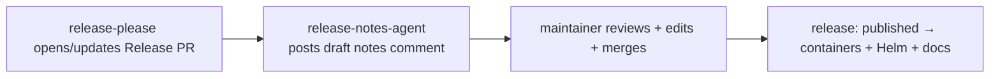

# Agentic Release Workflow

Companion to [release-strategy.md](./release-strategy.md) and
[release-backlog.md](./release-backlog.md).

release-please handles the **deterministic** release mechanics (version bump, changelog,
tag, GitHub Release). This adds a **read-only AI assistant** on top for the *judgment /
narrative* step that still needs a human today: writing the human-facing release notes.

**Principle: the agent *proposes*, a maintainer *disposes*.** The agent never bumps
versions, edits files, tags, merges, or publishes — those stay with release-please and the
maintainer who merges the Release PR.

---

## What it does

The workflow [`.github/workflows/release-notes-agent.md`](../../.github/workflows/release-notes-agent.md)
runs only on the release-please **Release PR**. On each update it posts a single PR comment
containing:

- an **"Announcing Akri v{version}"** narrative (for the Release body / blog),
- the changes grouped into Features / Bug Fixes / Perf / Dependencies / Breaking Changes,
- an **Upgrade notes** section (CRD / Helm / flag changes requiring user action),
- a **Validated With** Kubernetes-version table drafted from CI results,
- a pre-merge checklist (bug bash, confirm versions, merge to publish).

The maintainer reviews the comment, edits as needed, and merges the Release PR — which
triggers the existing publish pipelines. Nothing the agent does is irreversible.

## Where it fits

## Guardrails (built into the workflow)

- **Read-only** repo permissions; the *only* possible write is one PR comment via
  `gh-aw` **`safe-outputs`**.
- **Scoped trigger** — an `if:` guard limits it to `release-please--*` branches (plus manual
  `workflow_dispatch`); it no-ops on ordinary PRs.
- **`roles: [admin, maintainer, write]`** — only trusted users can trigger it.
- **Untrusted input handling** — the prompt tells the agent to ignore instructions embedded
  in PR/issue/commit text (prompt-injection defense); keep `gh-aw`'s network firewall and
  tool allow-listing on.
- **No release authority** — it cannot tag, merge, or publish. That is release-please's job
  (via the GitHub App token, strategy §7.2).

## Turning it on

1. **Install the extension** (one-time, local): `gh extension install github/gh-aw`.
2. **Pick an engine** — the workflow uses `engine: copilot`. Ensure the repo/org has the
   corresponding AI access (Copilot; or switch to `claude`/`codex` with that provider's
   secret). See the [gh-aw docs](https://github.com/github/gh-aw).
3. **Compile** the markdown into a runnable Action:
   `gh aw compile release-notes-agent` → produces `.github/workflows/release-notes-agent.lock.yml`.
4. **Commit both** the `.md` source and the generated `.lock.yml`.
5. **Verify** by opening the next release-please Release PR (or run it via *Actions →
   release-notes-agent → Run workflow*). Confirm the draft comment appears.

> Keep the engine/model **pinned** so the release experience is stable, and re-run
> `gh aw compile` whenever you edit the `.md` source.

## Extending it (optional, see backlog)

Same propose-not-dispose pattern, each as its own read-only / `safe-outputs`-gated workflow:

- **Release-readiness triage** (scheduled): summarize open issues, flaky tests, and stale
  PRs into a go/no-go report before the bug bash.
- **Dependency-update repair**: when `cargo update` breaks the build, assign the Copilot
  coding agent to fix it or file a scoped issue.
- **Backport assistant**: cherry-pick a merged fix onto a maintenance branch and open a PR.

Do **not** add agents to the deterministic core (version math, tagging, container/Helm
publish) — that only adds nondeterminism and risk.
