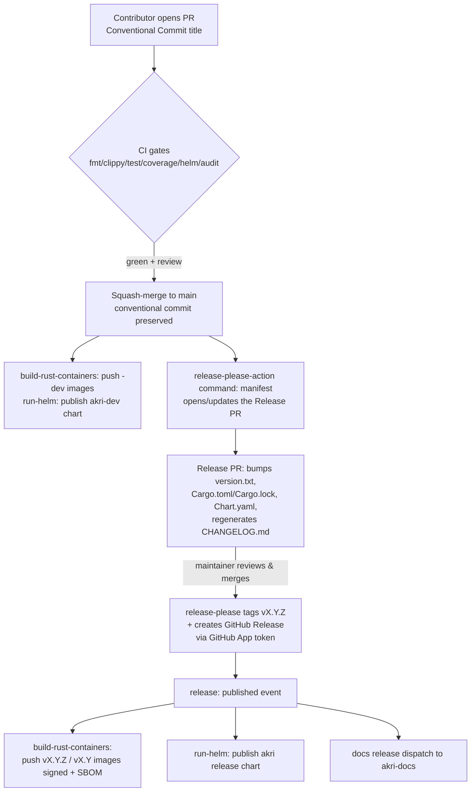

# Akri Release Management Strategy

> Status: Proposal / RFC
> Scope: `project-akri/akri` (this repo) + coordination with `project-akri/akri-docs`
> Goal: Replace the manual, checklist-driven release process with an automated,
> reproducible, low-toil pipeline built around **Conventional Commits** and
> **[release-please](https://github.com/googleapis/release-please)**.
>
> Open questions, risks, and the process backlog live in
> **[release-backlog.md](./release-backlog.md)**.

---

## 1. Executive summary

Today an Akri release is a 12-step manual checklist executed by a maintainer. It mixes
genuinely necessary human judgement (bug bash, "what do we support") with mechanical toil
(bumping versions across ~10 files, writing a changelog, cutting a GitHub release,
confirming that container builds fired). The mechanical toil is error-prone and slow.

This strategy proposes:

1. **Adopt Conventional Commits** as the enforced PR/commit convention.
2. **Adopt release-please** to automate version bumping, changelog generation, git tagging,
   and GitHub Release creation via a bot-maintained "Release PR".
3. **Keep `version.txt` as the single source of truth** via release-please's `simple`
   release type; derive every other version string with `extra-files` updaters — retiring
   the bespoke `version.sh` + `check-versioning.yml` + `/version` machinery.
4. **Keep the existing publish pipelines** (`build-rust-containers.yml`, `run-helm.yml`)
   which already trigger on `release: published` — release-please becomes the thing that
   *publishes* the release, and the existing workflows do the rest unchanged.
5. **Authenticate release-please with a GitHub App token** (not `GITHUB_TOKEN`), which is
   mandatory for the published-release event to trigger those downstream pipelines (§7.2).
6. **Harden the supply chain** (keyless cosign signing, SBOM attestation) as part of the
   release publish, building on work already done (pinned `h2` fork, provenance control).

The result: a maintainer's release action becomes *"review the Release PR and click merge."*
Everything downstream is automated and auditable.

---

## 2. Current state (v0.13.26)

- **Source of truth:** `version.txt`; `version.sh` fans it into ~8 files in two shapes —
  full semver (`Cargo.toml`, `Cargo.lock`, `Chart.yaml`) and the CRD API version `vMAJOR`
  (`mod.rs`, both CRD YAMLs, `values.yaml`). See §5 for the authoritative list.
- **Bumping:** `check-versioning.yml` requires `version.txt` to change per PR (unless a
  `same version` label); maintainers bump via a `/version` PR comment; monthly
  `auto-update-dependencies.yml` runs `cargo update` + a patch bump.
- **Publish (already release-aware):** `build-rust-containers.yml` pushes all components
  (`linux/amd64,arm64,arm/v7`) to `ghcr.io/project-akri/akri/*` — `-dev` tags on `main`,
  `vX.Y.Z`/`vX.Y` on `release: published`. `run-helm.yml` publishes the `akri-dev` chart on
  merge and the `akri` chart on release (to the `gh-pages` repo).
- **Release act:** a maintainer manually creates the GitHub Release; that single
  `release: published` event fans out to the publish pipelines. `CHANGELOG.md` is
  hand-written; docs release separately in `akri-docs`.

### Pain points
| Pain | Impact |
|---|---|
| `version.txt` + `version.sh` + `check-versioning.yml` are bespoke | Drift risk, maintenance burden |
| `/version` comment to bump | Bump level unlinked to actual change semantics |
| Hand-written CHANGELOG, manual GitHub Release | Slow, error-prone, high-stakes manual click |
| No release signing / SBOM / provenance | Supply-chain gap for a CNCF Sandbox project |

---

## 3. Why release-please

**release-please** ([googleapis/release-please](https://github.com/googleapis/release-please))
"automates CHANGELOG generation, the creation of GitHub releases, and version bumps." It
parses Conventional Commits and maintains a **Release PR**; when that PR is merged it
updates the changelog + version files, tags the commit, and creates a GitHub Release. It
**does not** publish to package managers — which is exactly right for Akri (we ship
container images + a Helm chart, not crates).

**Fit for Akri:**
- ✅ Version bump decided *automatically* from commit types (`feat`→minor, `fix`→patch,
  `!`/`BREAKING CHANGE`→major).
- ✅ **`simple` release type is literally "a repository with a `version.txt` and a
  `CHANGELOG.md`"** — our existing source of truth becomes the tool's source of truth, so
  no source-of-truth flip and no pipeline changes for files that read `version.txt`.
- ✅ **Arbitrary-file version propagation** via `extra-files` (typed TOML/YAML/JSON updaters
  and inline/block annotations) — this replaces `version.sh` for the derived files.
- ✅ Creates the git tag + GitHub Release → **this is exactly the `release: published`
  event our container & Helm pipelines already consume** (given the right token, see §7.2).

**Things we must design around:**
- ⚠️ **Rust workspaces** require *manifest mode* plus the **`cargo-workspace` plugin** to
  keep `Cargo.toml` versions and `Cargo.lock` in sync across all member crates. We combine
  this with the `simple` type for `version.txt` (see §5).
- ⚠️ A release created with the default `GITHUB_TOKEN` **does not trigger other workflows**.
  We must mint a **GitHub App token** so `release: published` fans out (see §7.2). This is a
  correctness requirement, not a preference.
- ⚠️ The **release PR is force-rebuilt on every run**, so any file that must be in the tagged
  commit has to be *release-please-managed* (config/`extra-files`), not added by a side job.
  This shapes how we handle the CRD `vMAJOR` string (see §5.2).

> Comparison note: release-plz was the other candidate. It is Rust-native but its headline
> feature (publishing to crates.io) is unused by Akri, and it only edits Cargo files +
> CHANGELOG — forcing a separate bridge for `version.txt`/Helm/CRD files. release-please's
> `extra-files` handles those natively, so it is the better fit here.

---

## 4. Target end-to-end flow



**Human touch points shrink to two:**
1. Normal PR review (unchanged).
2. Review & merge the **Release PR** (replaces steps 5, 6, 7, 10 of the old checklist).

Everything else in the old checklist is either automated or becomes a periodic,
decoupled task (see §8).

---

## 5. Handling Akri's version files with release-please

Akri has **two version shapes** across ~8 files:
- **Full semver** (`0.13.26`): `version.txt`, `Cargo.toml`, `Cargo.lock`, `Chart.yaml`
  (`version` + `appVersion`).
- **CRD API version** (`vMAJOR`, e.g. `v0`): `shared/src/akri/mod.rs` (`API_VERSION`), the
  two CRD YAMLs, and `values.yaml` (`akri.sh` group version).

release-please handles each group differently.

### 5.1 The semver files — fully release-please-managed
- `version.txt` + `CHANGELOG.md` → owned by the **`simple`** release type on the root
  package (`.`). This is the canonical version.
- `Cargo.toml` (all members via `workspace.package.version`) + `Cargo.lock` → the **`rust`**
  release type plus the **`cargo-workspace`** plugin (the documented way to release a Rust
  monorepo). The plugin walks the workspace graph and keeps the lockfile in sync.
- `Chart.yaml` `version` and `appVersion` → **`extra-files`** YAML updaters.

Because *all* of these are release-please-managed, the Release PR is **self-contained** —
no side job commits to its branch (which release-please would clobber on its next run).

> `simple` (version.txt) and `rust` (Cargo) are combined in one manifest release, kept in
> lockstep by the `linked-versions` plugin. Whether `cargo-workspace` handles the *virtual*
> `workspace.package.version` is the #1 Phase-1 spike item (§9); fallback is an `extra-files`
> TOML updater + `cargo update --workspace` in the release job.

### 5.2 The CRD `vMAJOR` files — decouple (recommended) or annotate
The CRD API version is *not* a semver string and today is derived as `v{MAJOR}`. Coupling it
to the product major means a `1.0.0` release would force a `v0→v1` CRD migration purely for
marketing reasons. **Recommended: decouple it.** Freeze the CRD API version and change it
only through a deliberate CRD-revision PR (its own conversion/upgrade story). Then
release-please **never touches** `mod.rs`, the CRD YAMLs, or `values.yaml`, the hardest
propagation disappears, and `version.sh` + `check-versioning.yml` can be deleted entirely.

*If the team prefers to keep them coupled*, mark the major in each file with a release-please
annotation so the Generic updater rewrites only the major component:
```rust
// shared/src/akri/mod.rs
pub const API_VERSION: &str = "v0"; // x-release-please-major
```
```yaml
# deployment/helm/crds/akri-configuration-crd.yaml
  versions:
    - name: v0 # x-release-please-major
```
Validate this in Phase 1 — the Generic updater must recognize the `v0` token; if not, keep a
minimal post-merge `version.sh`-style step scoped to *only* these four files, run in the
`release` job before the tag is pushed.

---

## 6. Conventional Commits (the enabling convention)

release-please's automation is only as good as the commit history. Adopt Conventional Commits
repo-wide:

- **Enforce on PR titles** (squash-merge means the PR title becomes the commit): add a
  lightweight `conventional-pr-title` check (e.g. `amannn/action-semantic-pull-request`).
- **Types → bump mapping.** Akri is **pre-1.0**, so `bump-minor-pre-major` +
  `bump-patch-for-minor-pre-major` (set in §7.1) apply:
  | Prefix | Changelog | Bump (pre-1.0) | Bump (≥1.0) |
  |---|---|---|---|
  | `feat:` | Features | patch | minor |
  | `fix:` | Bug Fixes | patch | patch |
  | `perf:` (`opt:` alias) | Perf & Optimizations | patch | patch |
  | `feat!:` / `BREAKING CHANGE:` | Breaking | **minor** | major |
  | `refactor`/`docs`/`test`/`ci`/`chore` | hidden | none | none |

  > ⚠️ Pre-1.0, breaking changes bump *minor* and features bump *patch* — surprising to
  > newcomers. When Akri cuts `1.0.0`, drop the two `*-pre-major` flags for standard semver.
  > (Whether to cut 1.0 is an open decision — see the backlog.)
- **Repo enforces squash-merge** so one PR = one clean conventional commit. release-please
  explicitly recommends squash-merge for a linear history and correct changelog scoping,
  and features like `BEGIN_COMMIT_OVERRIDE` / `Release-As:` only work reliably with it.
- **Releasable units**: release-please only opens/updates a Release PR when it sees
  `feat`, `fix`, or `deps` commits since the last release; `chore`/`build`/`ci` alone won't
  trigger a release (and, being marked `hidden` in `changelog-sections`, they don't appear
  in the changelog either).

### 6.1 Changelog format (release-please default = Keep-a-Changelog)
Use release-please's **default changelog type**, which "groups by commit type and links to
pull requests and commits" — the standard Keep-a-Changelog / conventionalcommits.org layout
(`### Features`, `### Bug Fixes`, …). This is the most standard, least-maintenance option and
needs no external template engine. Customize only the section mapping so Akri's historical
`opt:` prefix surfaces:

```jsonc
// release-please-config.json (excerpt) — visible sections; map opt→Perf; hide the rest
"changelog-sections": [
  { "type": "feat",  "section": "Features" },
  { "type": "fix",   "section": "Bug Fixes" },
  { "type": "perf",  "section": "Performance & Optimizations" },
  { "type": "opt",   "section": "Performance & Optimizations" },
  { "type": "deps",  "section": "Dependencies" },
  { "type": "chore", "section": "Miscellaneous", "hidden": true }
]
```

> The manually curated **"Validated With" Kubernetes-version table** cannot come from
> commits. Inject it via the release PR body / a `docs:` edit, or append it as a fixed
> section after release-please generates the notes — this stays a small human step.

---

## 7. Concrete implementation

### 7.1 Config files
`release-please-config.json` (repo root):
```jsonc
{
  "$schema": "https://raw.githubusercontent.com/googleapis/release-please/main/schemas/config.json",
  "release-type": "simple",
  "include-component-in-tag": false,     // tags are v<version>, not <component>-v<version>
  "bump-minor-pre-major": true,          // pre-1.0: breaking => minor, feat => patch-ish
  "bump-patch-for-minor-pre-major": true,
  "changelog-sections": [ /* see §6.1 */ ],
  "packages": {
    ".": {
      "extra-files": [
        { "type": "toml", "path": "Cargo.toml", "jsonpath": "$.workspace.package.version" },
        { "type": "yaml", "path": "deployment/helm/Chart.yaml", "jsonpath": "$.version" },
        { "type": "yaml", "path": "deployment/helm/Chart.yaml", "jsonpath": "$.appVersion" }
      ]
    }
  }
}
```
`.release-please-manifest.json` (bootstrap with the current version so history isn't re-parsed):
```json
{ ".": "0.13.26" }
```
> Tag format matters: our pipelines expect `vX.Y.Z`. `include-component-in-tag: false`
> yields `v0.13.26`. Confirm the git-tag string the container/helm `type=semver` metadata
> steps consume still matches.
>
> ⚠️ `Cargo.lock` is **not** updated by the `simple` release type. The
> `.github/workflows/release-please-lockfile.yml` workflow closes this gap: it runs
> `cargo update --workspace` on the Release PR and commits the refreshed `Cargo.lock`, so the
> tagged commit stays consistent. (Akri's crates use `version.workspace = true`, so
> `release-type: rust` + `cargo-workspace` is *not* a clean fit — hence the lockfile-sync
> workflow.)

### 7.2 Workflow + the mandatory GitHub App token
A GitHub Release created with the default `GITHUB_TOKEN` **will not** emit a `release:
published` event that triggers other workflows (GitHub blocks that to prevent recursion).
Since our whole design relies on `build-rust-containers.yml` and `run-helm.yml` reacting to
that event, release-please **must** authenticate as a **GitHub App** (also gives us
short-lived, human-independent, scoped credentials — better than a long-lived PAT).

**One-time setup:**
1. Create an org-owned GitHub App (e.g. "Akri Release Bot") with repository permissions:
   `contents: write`, `pull requests: write`, `issues: write` (for the `autorelease:*`
   labels). Install it on `project-akri/akri`.
2. Store its **App ID** and **private key** as repo/org secrets
   (`RELEASE_APP_ID`, `RELEASE_APP_PRIVATE_KEY`).

`.github/workflows/release-please.yml`:
```yaml
name: release-please
on:
  push:
    branches: [ main ]

permissions: {}   # the App token carries the scopes; job token stays minimal

jobs:
  release-please:
    if: github.repository == 'project-akri/akri'
    runs-on: ubuntu-latest
    steps:
      - uses: actions/create-github-app-token@v1
        id: app-token
        with:
          app-id: ${{ secrets.RELEASE_APP_ID }}
          private-key: ${{ secrets.RELEASE_APP_PRIVATE_KEY }}

      - uses: googleapis/release-please-action@v4
        with:
          command: manifest
          token: ${{ steps.app-token.outputs.token }}   # App token => release triggers downstream workflows & PR CI
          config-file: release-please-config.json
          manifest-file: .release-please-manifest.json
```
Because the release (and the Release PR) are created by the App identity:
- the `release: published` event **does** fire → containers + Helm publish automatically;
- CI **does** run on the Release PR (default-token PRs are skipped) → the release commit is
  fully gated before merge.

### 7.3 Required / recommended changes to existing pipelines
- **`build-rust-containers.yml` / `run-helm.yml`** — *no trigger changes needed*; they
  already listen on `release: published`, which now fires because of the App token. Verify
  the `docker/metadata-action` `type=semver` parsing still matches the `vX.Y.Z` tag
  release-please creates (§7.1).
- **`check-versioning.yml`** — **retire** (version.txt is now bot-owned). Optionally invert
  it into a guard that *fails* PRs which hand-edit `version.txt`, `Cargo.toml` version, or
  `CHANGELOG.md` outside a release-please PR, preventing drift.
- **`update-versions.yml`** (`/version` comment) — **retire**; bump level derives from
  commits. For a forced version use a `Release-As: X.Y.Z` commit footer or `release-as` config.
- **`auto-update-dependencies.yml`** — **keep**, but stop it from bumping the version
  (drop the `./version.sh -u -p` step). Have it land a `deps:`/`fix(deps):` commit; the next
  release PR picks up the bump automatically.
- **Branch protection** — allow the Akri Release Bot App to push the `release-please--*`
  branch; the human still clicks merge.

### 7.4 Supply-chain hardening (add to `build-rust-containers.yml`)
- Sign images with **cosign keyless** (OIDC) on the `release`/`push` path.
- Generate & attach **SBOMs** (syft) and image **provenance/attestations**.
- Continue pinning the `h2` fork by commit (already done) and keep `cargo audit` (daily).
- Consider `cargo vet`/`cargo deny` in CI to formalize the "update deps / file issue"
  checklist step.

---

## 8. Old 12-step checklist → new model

| # | Old manual step | New home |
|---|---|---|
| 1 | Test latest supported K8s versions, update test matrix | **Decoupled periodic task**: scheduled workflow bumps kind/k8s matrix + a `docs:` PR. Not release-blocking. |
| 2 | Test/bump latest Rust | **Decoupled**: `rust-toolchain.toml` bump via PR (already `1.88`). CI proves it. |
| 3 | Bug bash | **Kept as human gate** before merging the Release PR (release readiness review). |
| 4 | Tarpaulin update/run | Already `run-tarpaulin.yml` in CI; keep. Dependabot updates the action. |
| 5 | Update deps not auto-updated / file issues | `auto-update-dependencies.yml` + `cargo audit` + (new) `cargo deny`. Failures file issues automatically. |
| 6 | Update CHANGELOG (feat/fix prefix) | **Automated** by release-please from Conventional Commits. |
| 7 | Create GitHub Release | **Automated** by release-please on Release-PR merge. |
| 8 | Rebase http-extensibility | Track as a normal branch/PR; not part of core release flow (revisit if still relevant). |
| 9 | Tweet / Slack / blog after workflows finish | **Automated announcement hook** on `release: published` (post to Slack; draft social copy). Human sends blog. |
| 10 | Confirm container builds triggered | **Eliminated** — the Release *is* the trigger; add a status check that the publish workflows succeeded and mark the release. |
| 11 | Release the docs site | **Automated dispatch**: `release: published` sends `repository_dispatch` to `akri-docs` to cut a matching docs version. |
| 12 | Review CII/OpenSSF best practices | **Decoupled quarterly task**; add an OpenSSF Scorecard workflow for continuous signal. |

---

## 9. Phased migration plan

**Phase 0 — Foundations (low risk, no behavior change)**
- Enforce Conventional Commit PR titles + squash-merge.
- Add `release-please-config.json` + `.release-please-manifest.json` (bootstrapped at the
  current version) and the GitHub App + secrets.
- Decide the CRD-version question (§5.2): decouple (recommended) or coupled-with-annotations.

**Phase 1 — Spike / shadow mode**
- Run `release-please-action` on a test branch with **`skip-github-release: true`** so it
  only opens a Release PR and does **not** tag or release.
- Prove the two open technical risks: (a) the `cargo-workspace` plugin correctly bumps the
  virtual `workspace.package.version` + `Cargo.lock`; (b) `extra-files` (and, if coupled,
  the `x-release-please-major` annotations) rewrite every file `version.sh` used to.
- Diff the bot's proposed CHANGELOG against a hand-cut one; tune `changelog-sections`.

**Phase 2 — Cut over**
- Remove `skip-github-release`. Do the next real release entirely through the Release PR,
  confirming `release: published` fires the container + Helm pipelines.
- Retire `check-versioning.yml` and `update-versions.yml`; delete/scoped-down `version.sh`.

**Phase 3 — Hardening & fan-out**
- Add cosign signing, SBOM, provenance to container publish.
- Add `akri-docs` release dispatch + Slack announcement automation.
- Add OpenSSF Scorecard + `cargo deny`.

**Phase 4 — Optional cleanup**
- If the CRD version was decoupled, remove all `vMAJOR` propagation code entirely.

---

## 10. Definition of done

- A maintainer ships a release by reviewing and merging one bot-authored Release PR — no
  hand-editing of version files, no manual GitHub Release, no `version.sh`.
- Signed container images (with SBOM), the Helm `akri` chart, and the docs release all
  publish automatically off `release: published`, with an observable success status.
