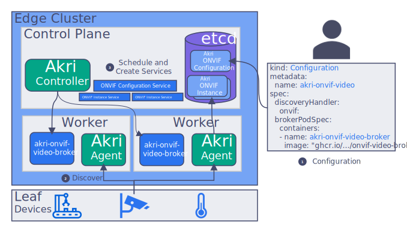

# Configuring Akri to Discover Devices via ONVIF
## Background
ONVIF is a standard used by many IP cameras and defines discovery and access for RTSP camera streams. Along with an ONVIF Discovery Handler, Akri has provided a generic ONVIF Configuration for initiating ONVIF discovery. Akri has also provided a sample broker (`akri-onvif-video-broker`), which acts as a frame server.

Using Akri's default ONVIF Configuration to discover and utilize ONVIF cameras looks like the following:


1. An operator applies the ONVIF Configuration to the cluster (by enabling ONVIF when installing the Akri Helm chart). They also specific a broker image -- `akri-onvif-video-broker` in the figure.
1. The Akri Agent uses the ONVIF Discovery Handler to discover the IP cameras and creates Instances for each discovered camera.
1. The Akri Controller sees the Instances and deploys `akri-onvif-video-broker` pods, which were specified in the Configuration. The Controller also creates a Kubernetes service for each ONVIF camera along with one service for all the ONVIF cameras.

All of Akri's components can be deployed by specifying values in its Helm chart during an installation. This section will cover the values that should be set to (1) deploy the ONVIF Discovery Handlers and (2) apply a Configuration that tells Akri to discover devices using that Discovery Handler. 
## Deploying the ONVIF Discovery Handler
In order for the Agent to know how to discover IP cameras an ONVIF Discovery Handler must exist. Akri supports an Agent image that includes all supported Discovery Handlers. This Agent will be used if `agent.full=true`. By default, a slim Agent without any embedded Discovery Handlers is deployed and the required Discovery Handlers can be deployed as DaemonSets. This documentation will use that strategy, deploying ONVIF Discovery Handlers by specifying `onvif.discovery.enabled=true` when installing Akri.
## ONVIF Configuration Settings
Instead of having to assemble your own ONVIF Configuration yaml, we have provided a [Helm
template](../deployment/helm/templates/onvif.yaml). Helm allows us to parametrize the commonly modified fields in our configuration files, and we have provided many for ONVIF (to see
them, run `helm inspect values akri-helm-charts/akri`). More information about the Akri Helm charts can be found in the [user guide](./user-guide.md#understanding-akri-helm-charts).
To apply the ONVIF Configuration to your cluster, simply set `onvif.configuration.enabled=true` along with any of the following additional Configuration settings when installing Akri.
### Discovery Handler Discovery Details Settings
Discovery Handlers are passed discovery details that are set in a Configuration to determine what to discover, filter out of discovery, and so on.
The ONVIF Discovery Handler, supports the following discovery details:
| Helm Key | Value | Default | Description |
|---|---|---|---|
| onvif.configuration.discoveryDetails.ipAddresses.action | Include, Exclude | Exclude | filter action to take on a set of IP addresses | 
| onvif.configuration.discoveryDetails.ipAddresses.items | array of IP addresses | empty | IP addresses that the filter action acts upon | 
| onvif.configuration.discoveryDetails.macAddresses.action | Include, Exclude | Exclude | filter action to take on a set of mac addresses |
| onvif.configuration.discoveryDetails.macAddresses.items | array of mac addresses | empty | mac addresses that the filter action acts upon |
| onvif.configuration.discoveryDetails.scope.action | Include, Exclude | Exclude | filter action to take on a set of scopes |
| onvif.configuration.discoveryDetails.scope.items | array of scopes | empty | scopes that the filter action acts upon |
| onvif.configuration.discoveryDetails.discoveryTimeoutSeconds | number of seconds | 1 | max amount of time the Discovery Handler should search before reporting any (newly) discovered devices |
### Broker Pod Settings
If you would like workloads ("broker" Pods) to be deployed automatically to discovered cameras, a broker image should be specified in the Configuration. Alternatively, if it meets your scenario, you could use the Akri frame server broker ("ghcr.io/deislabs/akri/onvif-video-broker"). If you would rather manually deploy pods to utilize the cameras advertized by Akri, don't specify a broker pod and see our documentation on [requesting resources advertized by Akri](./requesting-akri-resources.md). 
| Helm Key | Value | Default | Description |
|---|---|---|---|
| onvif.configuration.brokerPod.image.repository | image string | "" | image of broker Pod that should be deployed to discovered devices |
| onvif.configuration.brokerPod.image.tag | tag string | "latest" | image tag of broker Pod that should be deployed to discovered devices |

### Disabling Automatic Service Creation
By default, if a broker Pod is specified, the generic ONVIF Configuration will create services for all the brokers of a specific Akri Instance and all the brokers of an Akri Configuration. The creation of these services can be disabled.
| Helm Key | Value | Default | Description |
|---|---|---|---|
| onvif.configuration.createInstanceServices | true, false | true | a service should be automatically created for each broker Pod |
| onvif.configuration.createConfigurationService | true, false | true | a single service should be created for all brokers of a Configuration |

### Capacity Setting
By default, if a broker Pod is specified, a single broker Pod is deployed to each device. To modify the Configuration so that a camera is accessed by more or fewer nodes via broker Pods, update the `onvif.configuration.capacity` setting to reflect the correct number. For example, if your high availability needs are met by having 1 redundant
pod, you can update the Configuration like this by setting `onvif.configuration.capacity=2`.
| Helm Key | Value | Default | Description |
|---|---|---|---|
| onvif.configuration.capacity | number | 1 | maximum number of brokers that can be deployed to utilize a device (up to 1 per Node) |

### Installing Akri with the ONVIF Configuration and Discovery Handler
Leveraging the above settings, Akri can be installed with the ONVIF Discovery Handler and an ONVIF Configuration that specifies the Akri frame server broker:

```bash
helm repo add akri-helm-charts https://deislabs.github.io/akri/
helm install akri akri-helm-charts/akri-dev \
    --set onvif.discovery.enabled=true \
    --set onvif.configuration.enabled=true \
    --set onvif.configuration.brokerPod.image.repository="ghcr.io/deislabs/akri/onvif-video-broker" \
    --set onvif.configuration.brokerPod.image.tag="latest"
```

No discovery details were provided to filter the Discovery Handler's search so the Discovery Handler will find any ONVIF camera on the network and will deploy up to one broker pod to each camera, since `capacity` defaults to one. The brokers will supply the automatically created Instance Services and the Configuration Service with frames.

The following installation examples have been given to show how to the ONVIF Configuration can be tailored to you cluster:

* Filtering ONVIF cameras
* Changing the discovery timeout

#### Filtering ONVIF cameras
The ONVIF Discovery Handler supports basic filter capabilities has been provided.  Discovery details can be set in the Configuration that tell the Discovery Handler to either include or exclude specific IP addresses, MAC addresses, or ONVIF scopes.

For example, the following enables discovery of every camera that does not have an IP address of 10.0.0.1:
```bash
helm repo add akri-helm-charts https://deislabs.github.io/akri/
helm install akri akri-helm-charts/akri-dev \
    --set onvif.discovery.enabled=true \
    --set onvif.configuration.enabled=true \
    --set onvif.configuration.brokerPod.image.repository="ghcr.io/deislabs/akri/onvif-video-broker" \
    --set onvif.configuration.discoveryDetails.ipAddresses.action=Exclude \
    --set onvif.configuration.discoveryDetails.ipAddresses.items[0]=10.0.0.1
```

You can enable cluster access for every camera with a specific name, you can modify the Configuration like so:
```bash
helm repo add akri-helm-charts https://deislabs.github.io/akri/
helm install akri akri-helm-charts/akri-dev \
    --set onvif.discovery.enabled=true \
    --set onvif.configuration.enabled=true \
    --set onvif.configuration.brokerPod.image.repository="ghcr.io/deislabs/akri/onvif-video-broker" \
    --set onvif.configuration.discoveryDetails.scopes.action=Include \
    --set onvif.configuration.discoveryDetails.scopes.items[0]="onvif://www.onvif.configuration.org/name/GreatONVIFCamera" \
    --set onvif.configuration.discoveryDetails.scopes.items[1]="onvif://www.onvif.configuration.org/name/AwesomeONVIFCamera"
```

#### Changing the discovery timeout
The ONVIF Discovery Handler will search for up to `discoveryTimeoutSeconds` for IP cameras. This timeout can be increased or
decreased as desired, and defaults to 1 second if not configured. It can be set in the Configuration like this:
```bash
helm repo add akri-helm-charts https://deislabs.github.io/akri/
helm install akri akri-helm-charts/akri-dev \
    --set onvif.discovery.enabled=true \
    --set onvif.configuration.enabled=true \
    --set onvif.configuration.brokerPod.image.repository="ghcr.io/deislabs/akri/onvif-video-broker" \
    --set onvif.configuration.discoveryDetails.discoveryTimeoutSeconds=2
```

## Modifying a Configuration
Akri has provided further documentation on [modifying the broker PodSpec](./customizing-akri-installation.md#modifying-the-brokerpodspec), [instanceServiceSpec, or configurationServiceSpec](./customizing-akri-installation.md#modifying-instanceservicespec-or-configurationservicespec)
More information about how to modify an installed Configuration, add additional Configurations to a cluster, or
delete a Configuration can be found in the [Customizing an Akri Installation
document](./customizing-akri-installation.md).

## Implementation details
The ONVIF implementation can be understood by looking at several things:

1. [OnvifDiscoveryDetails](../discovery-handlers/onvif/src/discovery_handler.rs) defines the required properties
1. [OnvifDiscoveryHandler](../discovery-handlers/onvif/src/discovery_handler.rs) defines ONVIF camera discovery
1. [samples/brokers/onvif-video-broker](../samples/brokers/onvif-video-broker) defines the ONVIF broker