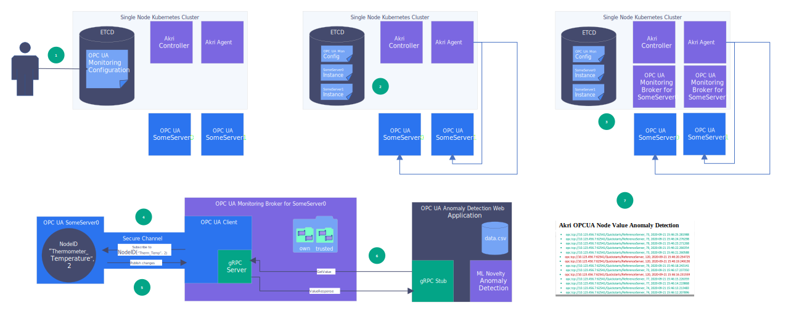

# OPC UA End-to-End Demo
OPC UA is a communication protocol for industrial automation. It is a client/server technology that comes with a
security and communication framework. This demo will help you get started using Akri to discover OPC UA Servers and
utilize them via a broker that contains an OPC UA Client. Specifically, a Akri Configuration called OPC UA Monitoring
was created for this scenario, which will show how Akri can be used to detect anomaly values of a specific OPC UA
Variable. To do so, the OPC UA Clients in the brokers will subscribe to that variable and serve its value over gRPC for
an anomaly detection web application to consume. This Configuration could be used to monitor a barometer, CO detector,
and more; however, for this example, that variable will represent the temperature of a thermostat and any value outside
the range of 70-80 degrees is an anomaly. 

The demo consists of the following components:
1. Two .NET OPC UA Servers with a temperature variable
1. (Optional) Certificates for the Servers and Akri brokers
1. An OPC UA Monitoring broker that contains an OPC UA Client that subscribes to a specific NodeID (for that temperature
   variable)
1. A Akri installation
1. An anomaly detection web application

## Demo Flow

1. An operator (meaning you!) applies to a single-node cluster the OPC UA Configuration, which specifies the addresses
   of the OPC UA Servers, which OPC UA Variable to monitor, and whether to use security.
1. Agent sees the OPC UA Configuration, discovers the servers specified in the Configuration, and creates an Instance
   for each server.
1. The Akri Controller sees the Instances in etcd and schedules an OPC UA Monitoring broker pod for each server.
1. Once the OPC UA Monitoring broker pod starts up, it will create an OPC UA Client that will create a secure channel
   with its server.
1. The OPC UA Client will subscribe to the OPC UA Variable with the NodeID with `Identifier` "Thermometer_Temperature"
   and `NamespaceIndex` 2 as specified in the OPC UA Configuration. The server will publish any time the value of that
   variable changes.
1. The OPC UA Monitoring broker will serve over gRPC the latest value of the OPC UA Variable and the address of the OPC
   UA Server that published the value.
1. The anomaly detection web application will test whether that value is an outlier to its pre-configured dataset. It
   then will display a log of the values on a web application, showing outliers in red and normal values in green.

The following steps need to be completed to run the demo:
1. Setting up a single-node cluster
1. (Optional) Creating X.509 v3 Certificates for the servers and Akri broker and storing them in a Kubernetes Secret
1. Creating two OPC UA Servers
1. Running Akri
1. Deploying an anomaly detection web application as an end consumer of the brokers

If at any point in the demo, you want to dive deeper into OPC UA or clarify a term, you can reference the [online OPC UA
specifications](https://reference.opcfoundation.org/v104/).

## Setting up a single-node cluster
Before running Akri, we need a Kubernetes cluster. If you do not have a readily available cluster, follow the steps
provided in the [end-to-end demo](./end-to-end-demo.md#set-up-cluster) to set up a single-node MicroK8s or K3s cluster. If using MicroK8s, you can skip the step of enabling privileged pods, as the OPC UA monitoring brokers do not need to run in a privileged security context.

## Creating X.509 v3 Certificates
**If security is not desired, this section can be skipped, as each monitoring broker will use an OPC UA Security Policy
of None if it cannot find credentials mounted in its pod.**

Akri will deploy an OPC UA Monitoring broker for each OPC UA Server a node in the cluster can see. This broker contains
an OPC UA Client that will need the proper credentials in order to communicate with the OPC UA Server in a secure
fashion. Specifically, before establishing a session, an OPC UA Client and Server must create a secure channel over the
communication layer to ensure message integrity, confidentiality, and application authentication. Proper application
credentials in the form of X.509 v3 certificates are needed for application authentication.

Every OPC UA Application, whether Client, Server, or DiscoveryServer, has a certificate store, which includes the
application's own credentials along with a list of trusted and rejected application instance certificates. According to
OPC UA specification, there are three ways to configure OPC UA Server and Clients' certificate stores so that they trust
each other's certificates, which are explained in the [OPC UA proposal](./proposals/opcua.md). This demo will walk
through the third method of creating Client and Server certificates that are issued by a common Certificate Authority
(CA). Then, that CA's certificate simply needs to be added to the trusted folder of Client and Servers' certificate
stores, and they will automatically trust each other on the basis of having a common CA. The following image walks
through how to configure the Client and Server certificate stores for Akri.


1. Generate an X.509 v3 Certificate for Akri OPC UA Monitoring brokers and sign it with the same CA that has signed the
   certificates of all the OPC UA Servers that will be discovered.
1. Create a Kubernetes Secret named opcua-broker-credentials that contains four items with the following key names:
   client_certificate, client_key, ca_certificate, and ca_crl.  
1. The credentials will be mounted in the broker at the path /etc/opcua-certs/client-pki.

### Running the certificate creation application
A .NET Console [OPC UA Certificate Generator application](../samples/opcua-certificate-generator) has been created to
simplify the process of creating a Certificate Authority (CA) and X.509 v3 certificates issued by that CA for the OPC UA
Client and Servers in this demo. Clone the Akri repository, navigate to the `opcua-certificate-generator` and follow the
instructions of the [README](../samples/opcua-certificate-generator/README.md) to generate the necessary certificates.

### Creating an opcua-broker-credentials Kubernetes Secret
The OPC UA Client certificate will be passed to the OPC UA Monitoring broker as a Kubernetes Secret mounted as a volume.
Read more about the decision to use Kubernetes secrets to pass the Client certificates in the [Credentials Passing
Proposal](./proposals/credentials-passing.md). Create a Kubernetes Secret, projecting each certificate/crl/private key
with the expected key name (ie `client_certificate`, `client_key`, `ca_certificate`, and `ca_crl`). Specify the file
paths such that they point to the credentials made in the previous section.
```bash
kubectl create secret generic opcua-broker-credentials \
--from-file=client_certificate=/path/to/AkriBroker/own/certs/AkriBroker\ \[<hash>\].der \
--from-file=client_key=/path/to/AkriBroker/own/private/AkriBroker\ \[<hash>\].pfx \
--from-file=ca_certificate=/path/to/ca/certs/SomeCA\ \[<hash>\].der \
--from-file=ca_crl=/path/to/ca/crl/SomeCA\ \[<hash>\].crl
```

When mounting certificates is enabled later in the [Running Akri section](#running-akri) with Helm via `--set
opcua.mountCertificates='true'`, the secret named `opcua-broker-credentials` will be mounted into the OPC UA monitoring
brokers. It is mounted to the volume `credentials` at the `mountPath` /etc/opcua-certs/client-pki, as shown in the [OPC
UA Configuration Helm template](../deployment/helm/templates/opcua.yaml). This is the path where the brokers expect to
find the certificates.

## Creating OPC UA Servers
Now, we must create some OPC UA Servers to discover. Instead of starting from scratch, we make some small modifications
to the OPC Foundation's .NET Console Reference Server.

1. Clone the [repository](https://github.com/OPCFoundation/UA-.NETStandard).

1. Open the UA Reference solution file and navigate to NetCoreReferenceServer project.

1. Open `Quickstarts.Reference.Config.xml`. This application configuration file is where many features can be configured,
   such as the application description (application name, uri, etc), security configuration, and base address. Only the
   latter needs to be modified if using no security. On lines 76 and 77, modify the address of the server, by replacing
   `localhost` with the IP address of the machine the server is running on. If left as   `localhost` the application
   will automatically replace it with the hostname of the machine which will be unreachable to the broker pod. On the
   same lines, modify the ports if they are already taken. Akri will preference using the tcp endpoint, since according
   to the [OPC UA Security Specification](https://reference.opcfoundation.org/v104/Core/docs/Part2/4.10/), secure
   channels over HTTPS do not provide application authentication.

1. (Optional) If using security, and you have already created certificates in the previous section, now you can modify
   the security configuration inside `Quickstarts.Reference.Config.xml` to point to those certificates. After using the
   OPC UA certificate generator application, your first Server's certificate store folder should be named SomeServer0.
   In line 17, change the `StorePath` to be `/path/to/SomeServer0/own`. Do the same in lines 24, 30, and 36, replacing
   `%LocalApplicationData%/OPC Foundation/pki/` with `/path/to/SomeServer0`. Finally, change the subject name in line 18
   to be `CN=SomeServer0`. 

1. Now it is time to create our temperature OPC UA Variable. Navigate to the function `CreateAddressSpace` on line 174
    of `ReferenceNodeManager.cs` that creates the AddressSpace of the OPC UA Server. To review some terms, [OPC UA
    specification](https://reference.opcfoundation.org/v104/Core/docs/Part1/3.2/) defines AddressSpace as the
    "collection of information that a Server makes visible to its Clients", a Node as "a fundamental component of an
    AddressSpace", and a Variable as a "Node that contains a value". Let create a thermometer Node which has a
    temperature variable. On line 195, insert the following:
    ```c#
    #region Thermometer
    FolderState thermometerFolder = CreateFolder(root, "Thermometer", "Thermometer");
    CreateDynamicVariable(thermometerFolder, "Thermometer_Temperature", "Temperature", DataTypeIds.Int16, ValueRanks.Scalar);
    #endregion
    ```
    We selected the `root` folder as the parent of the Thermometer node, which is the `CTT` folder created in line 185.
    The path to our Thermometer node is Server/CTT/Thermometer, making the NamespaceIndex of the Thermometer Node (and
    its variables) 2. We care about the `NamespaceIndex` because it along with `Identifier`, are the two fields to a
    `NodeId`. If you inspect the `CreateDynamicVariable` function, you will see that it creates an OPC UA variable,
    using the `path` parameter ("Thermometer_Temperature") as the `Identifier` when creating the NodeID for that
    variable. It then adds the variable to the `m_dynamicNodes` list. At the bottom of `CreateAddressSpace` the following
    line initializes a simulation that will periodically change the value of all the variables in `m_dynamicNodes`: 
    ``` c#
    m_simulationTimer = new Timer(DoSimulation, null, 1000, 1000);
    ```
    Let's change the simulation so that it usually returns a value between 70-80 and periodically returns an outlier of
    120. Go to the `DoSimulation` function. Replace `variable.Value = GetNewValue(variable);` with the following
    ```c#
    Random rnd = new Random();
    int value = rnd.Next(70, 80);
    if (value == 75)
    {
        value = 120;
    }
    variable.Value = value;
    ```
    Congrats! You've set up your first OPC UA Server. You should now be able to run it.

1. Repeat all the steps above to create a second OPC UA Server, using SomeServer1 certificates for step 4 if using
   security. In step 3, be sure your servers have different base address by modifying the port or running the second
   Server on a different host.

## Running Akri
1. Make sure your OPC UA Servers are running
1. Now it is time to install the Akri using Helm. We can specify that when installing Akri, we also want to create an
   OPC UA Configuration by setting the helm value `--set opcua.enabled=true`. In the Configuration as environment
   variables in the broker PodSpec, we will specify the `Identifier` and `NamespaceIndex` of the NodeID we want the
   brokers to monitor. These values are mounted as environment variables in the brokers. In our case that is our
   temperature variable we made earlier, which has an `Identifier` of `Thermometer_Temperature` and `NamespaceIndex` of
   `2`. Finally, since we did not set up a Local Discovery Server -- see [Setting up and using a Local Discovery
   Server](#setting-up-and-using-a-local-discovery-server-(windows-only)) in the Extensions section at the bottom of
   this document to use a LDS -- we must specify the DiscoveryURLs of the OPC UA Servers we want Agent to discover.
   Those are the tcp addresses that we modified in step 3 of [Creating OPC UA Servers](#creating-opc-ua-servers). Be
   sure to set the appropriate IP address and port number for the DiscoveryURLs in the Helm command below. If using
   security, uncomment `--set opcua.mountCertificates='true'`.   
    ```sh
    helm repo add akri-helm-charts https://deislabs.github.io/akri/
    helm install akri akri-helm-charts/akri \
        --set opcua.enabled=true \
        --set opcua.name=akri-opcua-monitoring \
        --set opcua.brokerPod.image.repository="ghcr.io/deislabs/akri/opcua-monitoring-broker" \
        --set opcua.brokerPod.env.IDENTIFIER='Thermometer_Temperature' \
        --set opcua.brokerPod.env.NAMESPACE_INDEX='2' \
        --set opcua.discoveryUrls[0]="opc.tcp://<SomeServer0 IP address>:<SomeServer0 port>/Quickstarts/ReferenceServer/" \
        --set opcua.discoveryUrls[1]="opc.tcp://<SomeServer1 IP address>:<SomeServer1 port>/Quickstarts/ReferenceServer/" \
        # --set opcua.mountCertificates='true'
    ```
    Akri Agent will discover the two Servers and create an Instance for each Server. Watch two broker pods spin up, one
    for each Server.
   For MicroK8s
    ```sh
    watch microk8s kubectl get pods -o wide
    ```
    For K3s and vanilla Kubernetes
    ```sh
    watch kubectl get pods -o wide
    ```
    To inspect more of the elements of Akri:
    - Run `kubectl get crd`, and you should see the CRDs listed.
    - Run `kubectl get akric`, and you should see `akri-opcua-monitoring`. 
    - If OPC UA Servers were discovered and pods spun up, the instances can be seen by running `kubectl get akrii` and
      further inspected by running `kubectl get akrii akri-opcua-monitoring-<ID> -o yaml`

## Deploying an anomaly detection web application as an end consumer of the brokers
A sample anomaly detection web application was created for this end-to-end demo. It has a gRPC stub that calls the
brokers' gRPC clients, getting the latest temperature value. It then determines whether this value is an outlier to the
dataset using the Local Outlier Factor strategy. The dataset is simply a csv with the numbers between 70-80 repeated
several times; therefore, any value significantly outside this range will be seen as an outlier. The web application
serves as a log, displaying all the temperature values and the address of the OPC UA Server that sent the values. It
shows anomaly values in red. The anomalies always have a value of 120 due to how we set up the `DoSimulation` function
in the OPC UA Servers.
1. Deploy the anomaly detection app and watch a pod spin up for the app.
    ```sh
    kubectl apply -f https://raw.githubusercontent.com/deislabs/akri/main/deployment/samples/akri-anomaly-detection-app.yaml
    ```
    For MicroK8s
    ```sh
    watch microk8s kubectl get pods -o wide
    ```
    For K3s and vanilla Kubernetes
    ```sh
    watch kubectl get pods -o wide
    ```
1. Determine which port the service is running on.
    ```sh
    kubectl get services
    ```
    Something like the following will be displayed. The ids of the broker services (`akri-opcua-monitoring-<id>-svc`)
    will likely be different as they are determined by hostname.
    ```
    NAME                                TYPE        CLUSTER-IP       EXTERNAL-IP   PORT(S)        AGE
    akri-anomaly-detection-app               NodePort    10.XXX.XXX.XXX   <none>        80:32624/TCP   66s
    kubernetes                          ClusterIP   10.XXX.XXX.X     <none>        443/TCP        15d
    akri-opcua-monitoring-7dd1e7-svc   ClusterIP   10.XXX.XXX.XXX   <none>        80/TCP         3m38s
    akri-opcua-monitoring-5fc2e6-svc   ClusterIP   10.XXX.XXX.XXX   <none>        80/TCP         3m38s
    akri-opcua-monitoring-svc          ClusterIP   10.XXX.XXX.XXX   <none>        80/TCP         3m38s
    ```
1. Navigate in your browser to http://ip-address:32624/ where ip-address is the IP address of your Ubuntu VM (not the
   cluster-IP) and the port number is from the output of `kubectl get services`. It takes 3 seconds for the site to
   load, after which, you should see a log of the temperature values, which updates every few seconds. Note how the values
   are coming from two different DiscoveryURLs, namely the ones for each of the two OPC UA Servers.

## Clean up
1. Delete the anomaly detection application deployment and service.
    ```sh
    kubectl delete service akri-anomaly-detection-app
    kubectl delete deployment akri-anomaly-detection-app
    ```
1. Delete the OPC UA Monitoring Configuration and watch the instances, pods, and services be deleted.
    ```sh
    kubectl delete akric akri-opcua-monitoring
    ```
    For MicroK8s
    ```sh
    watch microk8s kubectl get pods,services,akric,akrii -o wide
    ```
    For K3s and vanilla Kubernetes
    ```sh
    watch kubectl get pods,services,akric,akrii -o wide
    ```
1. Bring down the Akri Agent, Controller, and CRDs.
    ```sh
    helm delete akri
    kubectl delete crd instances.akri.sh
    kubectl delete crd configurations.akri.sh
    ```

## Extensions
Now that you have the end to end demo running let's talk about some ways you can go beyond the demo to better understand
the advantages of Akri. This section will cover:
1. Adding a node to the cluster
1. Using a Local Discovery Server to discover the Servers instead of passing the DiscoveryURLs to the OPC UA Monitoring
   Configuration
1. Modifying the OPC UA Configuration to filter out an OPC UA Server
1. Creating a different broker and end application
1. Creating a new OPC UA Configuration

### Adding a Node to the cluster
To see how Akri easily scales as nodes are added to the cluster, add another node to your (K3s, MicroK8s, or vanilla Kubernetes) cluster.
1. If you are using MicroK8s, create another MicroK8s instance, following the same steps as in [Setting up a single-node cluster](#setting-up-a-single-node-cluster) above. Then, in your first VM that is currently running Akri, get the join command by running `microk8s add-node`. In your new VM, run one of the join commands outputted in the previous step. 
1. Confirm that you have successfully added a node to the cluster by running the following in your control plane VM:
   ```sh
   kubectl get no
   ```
1. You can see that another Agent pod has been deployed to the new node; however, no new OPC UA Monitoring brokers have
   been deployed. This is because the default `capacity` for OPC UA is 1, so by default only one Node is allowed to
   utilize a device via a broker.
   ```sh
   kubectl get pods -o wide
   ```
1. Let's play around with the capacity value and use the `helm upgrade` command to modify our OPC UA Monitoring
   Configuration such that the capacity is 2. On the control plane node, run the following, once again uncommenting
   `--set opcua.mountCertificates='true'` if using security. Watch as the broker terminates and then four come online in
   a Running state.
   ```sh
   helm upgrade akri akri-helm-charts/akri \
      --set opcua.enabled=true \
      --set opcua.brokerPod.image.repository="ghcr.io/deislabs/akri/opcua-monitoring-broker" \
      --set opcua.brokerPod.env.IDENTIFIER='Thermometer_Temperature' \
      --set opcua.brokerPod.env.NAMESPACE_INDEX='2' \
      --set opcua.discoveryUrls[0]="opc.tcp://<SomeServer0 IP address>:<SomeServer0 port>/Quickstarts/ReferenceServer/" \
      --set opcua.discoveryUrls[1]="opc.tcp://<SomeServer1 IP address>:<SomeServer1 port>/Quickstarts/ReferenceServer/" \
      --set opcua.capacity=2 \
      # --set opcua.mountCertificates='true'
   ```
   For MicroK8s
   ```sh
   watch microk8s kubectl get pods,akrii -o wide
   ```
   For K3s and vanilla Kubernetes
   ```sh
   watch kubectl get pods,akrii -o wide
   ```
1. Once you are done using Akri, you can remove your worker node from the cluster. For MicroK8s this is done by running on the worker node:
   ```sh
   microk8s leave
   ```
   Then, to complete the node removal, on the host run the following, inserting the name of the worker node (you can look it
   up with `microk8s kubectl get no`):
   ```sh
      microk8s remove-node <node name>
   ```

### Setting up and using a Local Discovery Server (Windows Only)
**This walk-through only supports setting up an LDS on Windows, since that is the OS the OPC Foundation sample LDS
executable was written for.** 

A Local Discovery Server (LDS) is a unique type of OPC UA server which maintains a list of OPC UA servers that have
registered with it. The OPC UA Configuration takes in a list of DiscoveryURLs, whether for LDSes or a specific servers.
Rather than having to pass in the DiscoveryURL for every OPC UA Server you want Akri to discover and deploy brokers to,
you can set up a Local Discovery Server on the machine your servers are running on, make the servers register with the
LDS on start up, and pass only the LDS DiscoveryURL into the OPC UA Monitoring Configuration. Agent will ask the LDS for
the addresses of all the servers registered with it and the demo continues as it would've without an LDS. 

The OPC Foundation has provided a Windows based LDS executable which can be downloaded from their
[website](https://opcfoundation.org/developer-tools/samples-and-tools-unified-architecture/local-discovery-server-lds/).
Download version 1.03.401. It runs as a background service on Windows and can be started or stopped under Windows ->
Services. The OPC Foundation has provided [documentation](https://apps.opcfoundation.org/LDS/) on configuring your LDS.
Most importantly, it states that you must add the LDS executable to your firewall as an inbound rule. The .NET OPC UA
Console Servers that we set up previously are already configured to register with the LDS on its host at the default
address [from OPC UA Specification 12](https://reference.opcfoundation.org/v104/Core/docs/Part6/7.6/) of
`opc.tcp://localhost:4840/`. This is seen on line 205 of `Quickstarts.ReferenceServer.xml`. 

Make sure you have restarted your OPC UA Servers, since they attempt to register with their LDS on start up. Now, we can
install Akri with the OPC UA Configuration, passing in the LDS DiscoveryURL instead of both servers' DiscoveryURLs.
Replace "Windows host IP address" with the IP address of the Windows machine you installed the LDS on (and is hosting
the servers). Be sure to uncomment mounting certificates if you are enabling security:
```sh
helm install akri akri-helm-charts/akri \
    --set opcua.enabled=true \
    --set opcua.name=akri-opcua-monitoring \
    --set opcua.brokerPod.image.repository="ghcr.io/deislabs/akri/opcua-monitoring-broker" \
    --set opcua.brokerPod.env.IDENTIFIER='Thermometer_Temperature' \
    --set opcua.brokerPod.env.NAMESPACE_INDEX='2' \
    --set opcua.discoveryUrls[0]="opc.tcp://<Windows host IP address>:4840/" \
    # --set opcua.mountCertificates='true'
```
You can watch as an Instance is created for each Server and two broker pods are spun up.
For MicroK8s
```sh
watch microk8s kubectl get pods,akrii -o wide
```
For K3s and vanilla Kubernetes
```sh
watch kubectl get pods,akrii -o wide
```

### Modifying the OPC UA Configuration to filter out an OPC UA Server 
Instead of deploying brokers to all servers registered with specified Local Discovery Servers, an operator can choose to
include or exclude a list of application names (the `applicationName` property of a server's `ApplicationDescription` as
specified by UA Specification 12). For example, to discover all servers registered with the default LDS except for the
server named "SomeServer0", do the following.
```bash
helm install akri akri-helm-charts/akri \
    --set opcua.enabled=true \
    --set opcua.name=akri-opcua-monitoring \
    --set opcua.brokerPod.image.repository="ghcr.io/deislabs/akri/opcua-monitoring-broker" \
    --set opcua.brokerPod.env.IDENTIFIER='Thermometer_Temperature' \
    --set opcua.brokerPod.env.NAMESPACE_INDEX='2' \
    --set opcua.discoveryUrls[0]="opc.tcp://<Windows host IP address>:4840/" \
    --set opcua.applicationNames.action=Exclude \
    --set opcua.applicationNames.items[0]="SomeServer0" \
    # --set opcua.mountCertificates='true'
```
Alternatively, to only discover the server named "SomeServer0", do the following:
```bash
helm install akri akri-helm-charts/akri \
    --set opcua.enabled=true \
    --set opcua.name=akri-opcua-monitoring \
    --set opcua.brokerPod.image.repository="ghcr.io/deislabs/akri/opcua-monitoring-broker" \
    --set opcua.brokerPod.env.IDENTIFIER='Thermometer_Temperature' \
    --set opcua.brokerPod.env.NAMESPACE_INDEX='2' \
    --set opcua.discoveryUrls[0]="opc.tcp://<Windows host IP address>:4840/" \
    --set opcua.applicationNames.action=Include \
    --set opcua.applicationNames.items[0]="SomeServer0" \
    # --set opcua.mountCertificates='true'
```
### Creating a different broker and end application
The OPC UA Monitoring broker and anomaly detection application support a very specific scenario: monitoring an OPC UA
Variable for anomalies. The workload or broker you want to deploy to discovered OPC UA Servers may be different. OPC UA
Servers' address spaces are widely varied, so the options for broker implementations are endless. Passing the NodeID
`Identifier` and `NamespaceIndex` as environment variables may still suit your needs; however, if targeting one NodeID
is too limiting or irrelevant, instead of passing a specific NodeID to your broker Pods, you could specify any other
environment variables via `--set opcua.brokerPod.env.KEY='VALUE'`. Or, your broker may not need additional information
passed to it at all. Decide whether to pass environment variables, what servers to discover, and set the broker pod
image to be your container image, say `ghcr.io/<USERNAME>/opcua-broker`.
```sh
helm repo add akri-helm-charts https://deislabs.github.io/akri/
helm install akri akri-helm-charts/akri \
    --set opcua.enabled=true \
    --set opcua.discoveryUrls[0]="opc.tcp://<IP address>:<port>/" \
    --set opcua.discoveryUrls[1]="opc.tcp://<IP address>:<port>/" \
    --set opcua.brokerPod.image.repository='ghcr.io/<USERNAME>/opcua-broker'
    # --set opcua.mountCertificates='true'
```
> Note: set `opcua.brokerPod.image.tag` to specify an image tag (defaults to `latest`).

Now, your broker will be deployed to all discovered OPC UA servers. Next, you can create a Kubernetes deployment for
your own end application like [anomaly-detection-app.yaml](../deployment/samples/akri-anomaly-detection-app.yaml) and
apply it to your Kubernetes cluster. 

### Creating a new OPC UA Configuration
Helm allows us to parametrize the commonly modified fields in our Configuration files, and we have provided many. Run
`helm inspect values akri-helm-charts/akri` to see what values of the generic OPC UA Configuration can be customized,
such as the Configuration and Instance `ServiceSpec`s, `capacity`, and broker `PodSpec`. We saw in the previous section
how broker Pod environment variables can be specified via `--set opcua.brokerPod.env.KEY='VALUE'`. For more advanced
configuration changes that are not aided by the generic OPC UA Configuration Helm chart, such as credentials naming, we
suggest downloading the OPC UA Configuration file using Helm and then manually modifying it. See the documentation on
[customizing an Akri
installation](./customizing-akri-installation.md#generating-modifying-and-applying-a-custom-configuration) for more
details.