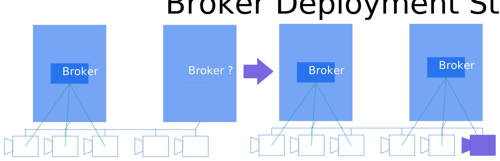
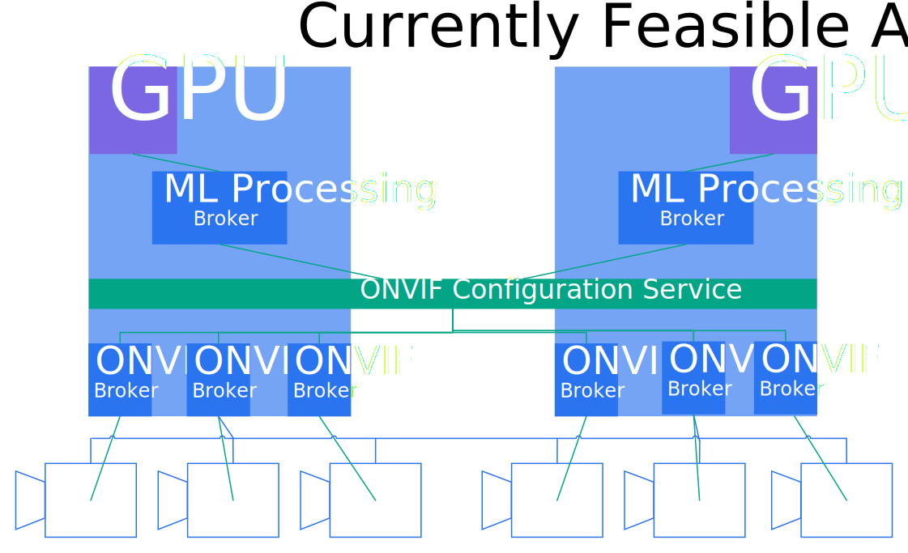
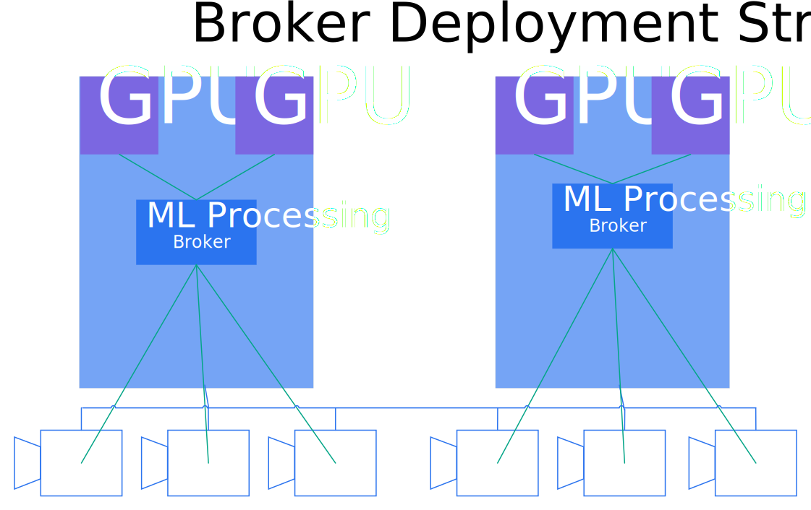

# New Broker Deployment Strategies
## Background 
Currently, broker pods are deployed in a DaemonSet like fashion. Any node that can see a leaf device gets to use it. For
every leaf device that is discovered by a node's Akri Agent, a single broker is deployed to that node -- how many nodes
get the broker is limited by capacity. If the leaf device is no longer visible (i.e. goes offline), then the broker is
brought down. If the leaf device reappears, the broker is re-scheduled. A user can specify how many nodes can utilize a
single leaf device by setting the capacity value. A value of two means at most two broker pods will utilize the leaf
device at once. For example, if there are N worker nodes, all N nodes can see a leaf device, and the capacity is at
least N, then the Akri Controller will schedule a broker pod to each node. It is important to note that in the current
solution, more than one broker cannot be scheduled to the same device on the same node – this could technically be done
if you pass a second Configuration. This is a fairly specific implementation that does not support all users' scenarios.
The next section discusses some ways the Akri Controller and Agent could be extended to allow for other broker
deployment strategies.
## New Deployment Strategies
### DeploymentSpec-based
Unlike a DaemonSet, where each broker is deployed once to each node (bounded by Configuration.Capacity), a 
DeploymentSpec-based approach could be provided.  With this approach, the number of brokers deployed would be governed by the minimum of Deployment.Replicas and Configuration.Capacity.  Brokers would be scheduled by the default Kubernetes scheduler.

One benefit to this would be high availability for non-shared Instances (currently, using the DaemonSet paradigm, only 1 broker is deployed per non-shared Instance), as the number of deployed brokers would be configured by Deployment.Replicas.

### Instance Pooling
With regular [Kubernetes device
plugins](https://kubernetes.io/docs/concepts/extend-kubernetes/compute-storage-net/device-plugins/), operators can
request a quantity of a resource for a pod, such as 2 GPUs or 4 MB of RAM. Akri does not support this, currently.
Rather, with Akri, only a single instance is ever exposed to a broker pod. An "instance pooling" strategy could solve
this, wherein one broker could be deployed for multiple Instances of the same Configuration. This would lead to less
broker pods being deployed and allow one broker to be a gateway for multiple devices. An `instance-pooling` field could
be added to the Configuration CRD with its value representing the number of Instances per broker.
```yaml
apiVersion: akri.sh/v0
kind: Configuration
metadata:
  name: akri-onvif-video
spec:
  protocol:
    onvif:
      ipAddresses: 
        action: Exclude
        items: []
    # ...
  brokerPodSpec:
    containers:
    - name: akri-onvif-video-broker
      image: "ghcr.io/..."
      resources:
        limits:
          "{{PLACEHOLDER}}" : "1"
  # ...
  instance-pooling: 3
  capacity: 1
```
Should the value be a "desired" number of instances per broker pod or a minimum? How should the Controller and the Akri
Agent handle the appearance of new instances? Or disappearance of Instances? If `instance-pooling` is set to 3 and there
are are 5 IP cameras visible to three worker nodes, should only one broker be scheduled on one node to three of the
devices leaving the other two unutilized, or should two brokers be scheduled with the second only connected to two
devices? Then, if a sixth camera comes online, what happens? Ideally, the second broker could now utilize that device,
getting it to the desired state of using three cameras. However, how would the information to find/use the device be
passed to the broker?  There are
several possibilities for supporting **dynamic instance pooling**:
1. An environment variable with connection information, such as the RSTP url for the IP camera, could be injected into
   the broker pod by the Controller. However, injecting environment variables causes pods to restart, so restarts must
   be expected. 
1. The broker could query etcd to get the Instances, routinely checking which Instances it's node has been selected to
   connect to and getting connection information from those Instances' `metadata` section. However, this would require
   extra logic to be added to user's brokers.
1. A side car container could be deployed which does the work of looking at Instances. That container could serve the
   connection information to the main broker container. This would reduce the amount of changes a user would have to
   make to their broker; however, they would have to implement this separate container. Or maybe this could be
   generalized.
1. The Controller could create a ConfigMap with metadata about instances that are assigned to a specific broker and 
   mount this ConfigMap into the broker as a volume. When the Controller wants to change the assignment of instances
   to brokers, it just needs to update the ConfigMaps. The changes are propagated into the broker mounted volumes and 
   brokers can adjust accordingly (see [Kubernetes 
   docs](https://kubernetes.io/docs/tasks/configure-pod-container/configure-pod-configmap/#mounted-configmaps-are-updated-automatically) 
   for reference).

A more immediate solution would be to implement **static instance pooling**. The `instance-pooling` value would define
the exact number of Instance that must be available for a broker to be scheduled. If `instance-pooling` is set to 3 and
there are five IP cameras visible to three worker nodes, then a broker would only be scheduled to one node. If a sixth
camera came online, another broker would be scheduled for the three available cameras. If one of the cameras in the
first set of 3 goes down, then that broker would be brought down. While this solution could lead to under utilization of
cameras, it is the easiest to implement and requires no extra logic in brokers. In order to prevent under utilization,
another option would be to configure a timeout. If a sixth camera does not come online after a specific period of time a
broker will be deployed to a smaller pool of instances than requested -- two in this scenario.

### Resource grouping
Rather than deploying a broker to a single or multiple (in the case of instance pooling) Instances of the same
Configuration, could brokers be scheduled to a specific grouping of heterogenous resources? For example, could one
machine learning processing broker be scheduled to 1 GPU and 3 IP cameras? Right now, this could be done by having the
ML pod point to each service exposed by the three IP camera brokers and one GPU broker. Or, as shown in the diagram
below, the GPU broker could act as the ML processing pod and point to the Configuration level IP camera service (which
exposes all six cameras in the diagram). 
Ideally, with resource grouping implemented, the architecture could instead look like the following:  In a sense, resource grouping allows
specifying multiple instance pools in one Configuration. 

### Exposing resources at the Configuration level
Currently, the Akri Controller is making scheduling decisions. For example, say a usb camera is plugged into two nodes
and a Configuration is applied to the cluster with a capacity of 1. At this point, the Akri Controller decides which
node to schedule the broker to. Say it picks node A, which doesn't have sufficient memory for the Kubernetes scheduler
to schedule the broker. The broker will stay in a pending state indefinitely. Instead of the Controller making these
scheduling decisions, could the decision be passed to the Kubernetes scheduler? Currently, when the Controller creates a
broker pod, it targets a specific node (via node affinity) and specific leaf device (via the resource limit
`akri.sh/akri-<protocolA>-<instance-name-hash>`).
```yaml
kind: Pod
metadata:
  labels:
    # ...
  name: <configuration-name>-<instance-name-hash>-pod
spec:
  affinity:
    nodeAffinity:
      requiredDuringSchedulingIgnoredDuringExecution:
        nodeSelectorTerms:
        - matchFields:
          - key: metadata.name
            operator: In
            values:
            - Worker
  containers:
    image: ghcr.io/…
    name: custom-broker
    resources:
       limits:
         akri.sh/<configuration-name>-<instance-name-hash>: "1"
```
Instead, a Controller could create a pod without node affinity and set the resource limit to be any leaf device of a
Configuration.
```yaml
kind: Pod
metadata:
  labels:
    # ...
  name: <configuration-name>-pod
spec:
  containers:
    image: ghcr.io/…
    name: custom-broker
    resources:
       limits:
         akri.sh/<configuration-name>: "1"
```
For this to work, all instances of a Configuration on a node must be advertized to the kubelet under the name
`akri.sh/<configuration-name>`. Currently, each instance on a node registers its own device plugin with the kubelet, so
that pods can be scheduled to the specific leaf device. This could stay the same and an additional device plugin could
be made for each Configuration on each node. That Configuration level device plugin would register with the kubelet
under the general name `akri.sh/<configuration-name>`. This means that if a node can see 3 IP cameras, the Akri Agent
will be running 4 device plugins: `akri.sh/akri-onvif-video-<hash1>`, `akri.sh/akri-onvif-video-<hash2>`,
`akri.sh/akri-onvif-video-<hash3>`, and `akri.sh/akri-onvif-video`. The Configuration device plugin could send a list of
actual devices back to the kubelet instead of "virtual" device usage slots as done currently to account for capacity. 

Advertizing resources at the Configuration level would also allow users to utilize the Akri Agent in order to expose
their resources to the cluster and then manually apply deployments that utilize Configuration level resources across the
cluster -- in this scenario there would be no `brokerPodSpec` in the Configuration. In this sense, if resources are
exposed at the Configuration level, users could choose their own deployment strategy.
