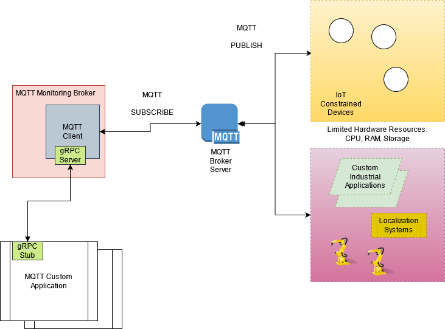

# MQTT Protocol Implementation

## Goal
Agent implements [MQTT Protocol](https://docs.oasis-open.org/mqtt/mqtt/v5.0/mqtt-v5.0.html), a light-weight
publish/subscribe messaging protocol widely used in Internet of Things (IoT).

Supporting MQTT as a protocol in Akri provides a mechanism by which Application Developers (IoT, Kubernetes)
can provide scalable applications based on current status of the IoT Devices within an environment. 

Depending on the IoT Device's availability the application pertaining to the data such a device produces
can be scaled accordingly.

## What can Akri solve?

Through the Discovery features, Akri can provide a _Plug-n-Process_ mechanism for IoT Devices connected to
the MQTT ecosystem. Introduction of new IoT Devices can help spin up microservices (applications) without
manual intervention of application developers. Since IoT Devices can range from anywhere between tens of devices
to a potential millions of devices, applications pertaining to only specific IoT Devices (monitoring, data acquisition,
 anomaly detection) becomes a tedious job for developers to bring up and tear down everytime these devices are 
dynamically introducted in environments (home, factories, experimental testbeds etc.)

## Why MQTT?
MQTT is a renowned messaging protocol for IoT. It is an OASIS Standard and is widely used in industrial
automation, home automation, automobiles, Oil & Gas sectors.

Since MQTT is a light-weight and efficient protocol based on TCP/IP Stack, integrating small micro-controllers
to large industrial machines is possible. Due to its Pub/Sub Mechanism it is able to achieve high scalability
in terms of introducing and communicating with large IoT Devices.

It also provides security communication and reliability over the network through the protocol's Quality of Service
levels.

For Further information into the recent MQTT v5 Protocol, refer to the 
[OASIS Specifications](https://docs.oasis-open.org/mqtt/mqtt/v5.0/mqtt-v5.0.html)

## Background

In an MQTT Enabled ecosystem, there are two major parts:

1. **MQTT Client**

2. **MQTT Broker**

### MQTT Client

An MQTT Client is any device that runs an MQTT Library implementation and connects to the MQTT Broker over a Network.
<sup>1</sup>

An MQTT Client can have a role of either a **publisher** or **subscriber**.

A **publisher** is a client generally producing data that is sent to the MQTT broker. A typical example could be
a micro-controller with a temperature sensor would publish the temperature value in a timely fashion over a wired/
wireless network to an MQTT Broker.

A **subscriber** is a client who is interested in the data that is being published by other clients within the network.

> Note: A publisher can also be a subscriber and there is generally no strict boundary defined. Example could be the
       same micro-controller with the temperature sensor can publish the temperature to the broker and subscribe to 
       the broker in order to await some control messages from an application

There are a lot of implementation of [Open-Source MQTT Clients in many programming languages](https://mqtt.org/software/)
as well as [Eclipse Paho Group](https://www.eclipse.org/paho/index.php?page=downloads.php) that provides Specification
Compliant MQTT Libraries.

### MQTT Broker

An MQTT Broker is responsible for receiving all messages, filtering these messages, determining who is subscribed to each
message, and sending these messages to respective subscriber clients<sup>1</sup>. It also provides session management between
clients and maintaining persistency for these sessions as well as authorization and authentication of clients.

There are a lot of [Open-Source and Proprietary MQTT Brokers](https://mqtt.org/software/) available. One of the renowned MQTT
Brokers is [Eclipse Mosquitto](https://mosquitto.org) which can be deployed on various infrastructure - on a single board computer
to on-premise server to a cloud.

### Message Exchange in MQTT

MQTT is a Pub/Sub mechanism for message exchange. This implies that there is _never a direct connection between MQTT Clients_.
All the message exchange occurs via mediating entity i.e. MQTT Broker. This provides a decoupling between publishing clients 
and subscribing clients.

MQTT Brokers filter incoming messages based on *Subject-Based Filtering*<sup>2</sup>. The protocol specifies the usage of 
[MQTT Topics](https://www.hivemq.com/blog/mqtt-essentials-part-5-mqtt-topics-best-practices/). 

### MQTT Topics

Topics are UTF-8 Strings in a heirarchical topic structure. Each topic level is separated by a forward slash (`/`). Example

    - acme/factory/Robot0001/joint
    - acme/factory/Machine10239/temperature
    - system
    - foo/bar/fizz/buzz

Topics are case sensitive and must contain at least 1 character.

Interested subscriber clients can either subscribe to the exact MQTT topic or can use wildcards to subscribe to multiple topics.

#### MQTT Topic Wildcards

1. Single Level `+`

        acme/factory/+/joint

    should provide information from all publishers that publish joint information

2. Mutli Level `#`

        acme/factory/#
    
    should provide information from all publishers in the acme factory

## Basic Communication 


Here `Device1` publishes temperature data to an MQTT Broker and `App1` and `App2` are interested in the data so they subscribe to the
topic `device1/temp`.

> Every MQTT PUBLISH message always contains the MQTT Topic string and the Payload (byte-format)

A more in-depth understanding of what **MQTT PUBLISH** and **MQTT SUBSCRIBE** messages contain can be found
[here](https://www.hivemq.com/blog/mqtt-essentials-part2-publish-subscribe/).


> NOTE: MQTT is completely data-agnostic. The Payload and Topic strings can be developed according to the application developer's
        perspective.


## Discovery Process

Since MQTT bases itself over the TCP/IP stack for networking, the specifications provide _handshaking_ mechanisms which can be leveraged
to discover IoT Devices that communicate with the MQTT Broker. Since the only mediating entity for message exchange is the MQTT Broker,
all clients only require the IP Address and the MQTT port of the broker as a basic form of initiation of communication. Default port for unsecure MQTT
Broker is 1883 and for a secure Broker is 8883.

The Akri Discovery Handler hence needs to have the URL Information for the MQTT Brokers and particular topics that need to be subscribed to
in the Akri configuration (based on understanding of OPC-UA).


## Akri's Custom Broker Interfacing with an MQTT Broker Server

> Note: due to conflicting naming for Akri's Broker as well as MQTT Broker, we refer to Akri's custom broker for MQTT as **MQTT Monitoring Broker**
  and MQTT's Broker as **MQTT Broker Server**

Akri's MQTT Monitoring Broker will be an MQTT Client that can connect to the MQTT Broker Server as well as subscribe to the topics defined. The 
connection on the network between the MQTT Broker Server and MQTT Monitoring Broker occur via [MQTT CONNECT] Command Packet and an acknowledgement
via [MQTT CONNACK] Command Packet<sup>1</sup>

An interaction between the mentioned components can be visualized as follows:


The interaction occurs as follows:

1. Akri's MQTT Monitoring Broker consisting of an MQTT Client connects with to the specified MQTT Broker Servers and initially sends an 
   **MQTT CONNECT** to the Broker Server with a unique `clientId`. A unique `clientId` is necessary to maintain a connection session with the Broker
   Server (stateful connection). Another parameter which needs to be set is `cleanSession` to False. This tells the MQTT Broker Server to maintain a 
   persistent session with the Monitoring Broker (all missed messages with Quality of Service 1 or 2 are stored in the Broker). All of this handled via
   standard MQTT Library APIs like [Eclipse Paho MQTT Library](https://www.eclipse.org/paho/index.php?page=downloads.php).

    a. (OPTIONAL - Security) Username and Password can be provided in the MQTT Library APIs to provide security. If TLS Security is not implemented the 
       Username/Password is sent as plain-text
    
    b. (OPTIONAL - Last Will and Testament) Last Will and Testament concept helps other MQTT Clients know if the a client has been disconnected abruptly.
       This might be an interesting concept if the Monitoring Broker is able to send information back to the IoT Devices as a way to control them.  A concise
       description of MQTT LW&T Concept can be found [here](https://www.hivemq.com/blog/mqtt-essentials-part-9-last-will-and-testament/)

      > NOTE: In a well developed MQTT Application, IoT Devices should provide a Will message which the MQTT Monitoring Broker can use to detect if these
         devices are still available and their related applications should be stopped or kept-running

2. After determining if the MQTT CONNECT message is not malformed, the MQTT Broker Server sends an Acknowledgement back the Monitoring Broker with 
   MQTT CONNACK command packet.

3. Upon successful connection with the MQTT Broker Server, the Monitoring Broker can subscribe to a list of MQTT topics with possible Quality of Service
   (QoS) parameter either set to `1` or `2` depending on the guarantees required (generally, a QoS of 1 should work)

4. The Broker Server then sends back an Acknowledgement of the requested subscriptions via the SUBACK packet. This packet contains return codes for all the
   list of topics and their QoS. 

5. If the IoT Devices already have been publishing data prior to connection of Monitoring Broker with an assumption that they publish their data with QoS 1,
   the Broker Server would publish all the information to the Monitoring Broker (persistent storage). If IoT Devices are yet to publish on their dedicated
   topics, the MQTT Broker Server will publish data to the Monitoring Broker once the data is available.

A possible integration of Akri's MQTT Monitoring Broker and MQTT Broker Server looks as follows:




## Questions

- Would a generic MQTT Monitoring Broker be possible to implement with Akri?
    - If not, maybe would it be wise to begin with a Specification like [Sparkplug MQTT Specification](https://sparkplug.eclipse.org) where the Topic Structure
      and the Payload are defined?

- Is gRPC Server required within the MQTT Monitoring Broker? Does the Publish/Subscribe mechanism require a different technology?

- How actually would Discovery Handler Look like? When one talks about Discovery Handler, is this pertaining to only MQTT Broker Server or the discovery of leaf
  devices in this scenario?

- Does the Integration of Akri with MQTT makes sense with already deployed MQTT Broker Servers on the Cloud or On-Premise Private Clouds or does it pertains only
  to Edge Devices where such MQTT Broker Servers are deployable e.g. Single-Board Computers (Raspberry Pi 4, Jetson Nano etc.),
  Small Form-Factor Computers like (Intel NUCs etc.)

## Miscellany

### Filters

- The only possible filters that might be available for User are inclusion of a MQTT Topics List.

For example a possible draft MQTT configuration to be applied to the cluster as:

```yaml
apiVersion: akri.sh/v0
kind: Configuration
metadata:
  name: mqtt
spec:
  discoveryDetails:
    name: mqtt
    discoveryDetails: |+
      serverUrls:
        - tcp://<SOME_IP_ADDRESS>:1883
        - ssl://<SOME_IP_ADDRESS>:8883
      topics:
        - akri-devices/Device23920/temp
        - robots/+/joints
        - system/subsystem1/device2032/#
```


## References

1 [HiveMQ Blog - MQTT Essentials Part 3 - Client Broker](https://www.hivemq.com/blog/mqtt-essentials-part-3-client-broker-connection-establishment/)

2 [HiveMQ Blog - MQTT Essentials Part 2 - Publish Subscribe](https://www.hivemq.com/blog/mqtt-essentials-part2-publish-subscribe/)