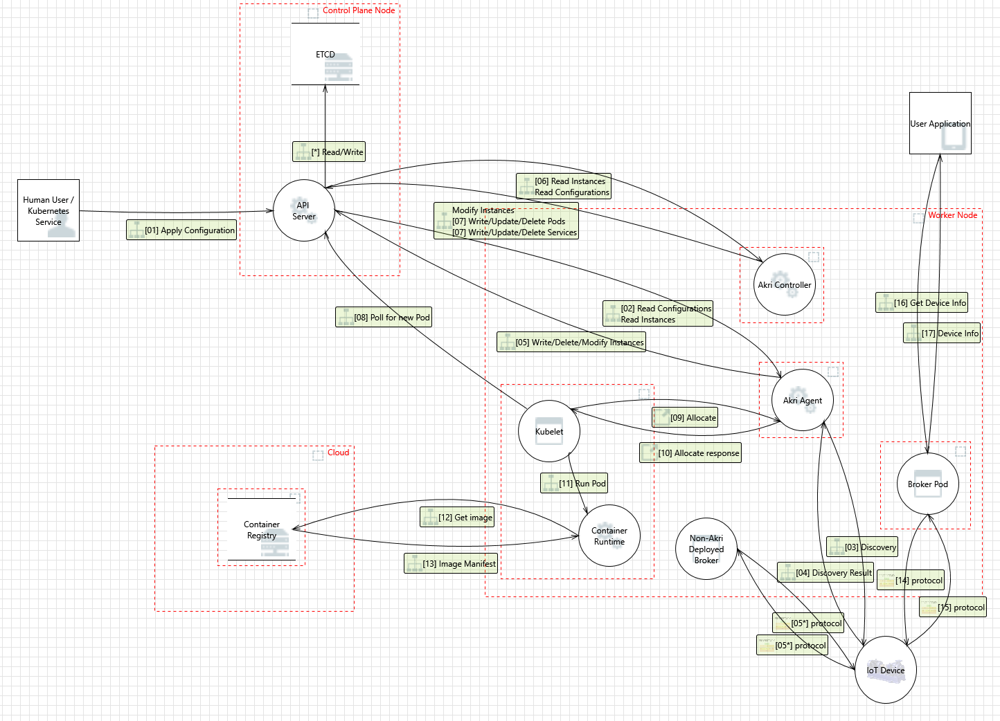

# Akri Security Proposal
The purpose of this proposal is to discuss how Akri can be leveraged to expose devices as resources in a Kubernetes cluster as securely as possible. Where does Akri have security weaknesses that can be tightened? What considerations need to be taken given that Akri is Kubernetes native? This proposal will cover the following:
1. General best practices for secure Kubernetes solutions
1. Threat model findings
1. Restricting Configuration creation via RBAC
1. Limiting device access
1. Device plugin security implications
1. Passing unique credentials to brokers
1. Division of responsibility

## General best practices 
In 2019 the Kubernetes Security Special Interest Group (SIG), at the time the Security Audit Working Group, had two firms (Trail of Bits and Atredis Partners) perform the ambitious task of creating a [threat model for Kubernetes](https://github.com/kubernetes/community/blob/master/sig-security/security-audit-2019/findings/Kubernetes%20Threat%20Model.pdf). It was a part of a full security audit of Kubernetes that they performed, which resulted in [three other documents](https://github.com/kubernetes/community/tree/master/sig-security/security-audit-2019/findings): a final report, a white paper, and a guide to attacking and securing Kubernetes. Put together, this audit provides advice on how to make secure Kubernetes solutions. To summarize some of the main takeaways that Akri can leverage:
1. Don’t use defaults: namespaces, network policies, RBAC, etc.
1. Use proper RBAC policies and disable ABAC
1. Use namespaces
1. Use network policies
1. Robust logging and alerting and remove all sensitive information from these logs
1. Limit which pods have access to API server
1. Create secure containers
    - Minimize image contents
    - Distroless base images 
    - Sign container images
    - Perform container vulnerability scanning 
    - Disallow privileged users inside the containers 

In 2020, the CNCF financial group completed a [threat modeling exercise](https://github.com/cncf/financial-user-group/tree/master/projects/k8s-threat-model). It includes many attack trees, diagramming attacks ranging from denial of service to malicious code execution. They also created a Kubernetes threat model for a cluster with three main machine trust boundaries: one control plane node, one worker node, and one container registry.

## Akri threat model
Akri’s threat model expanded up the one created by the CNCF financial group in the previous section. It depicts a Kubernetes cluster with single control plane node and single worker node which is running the Akri Controller and Agent. Two pods utilize an IoT device, one is the Akri broker created by the Akri Controller and the other was deployed by some other entity. There is a user application that gets device information from a service exposed by an Akri broker. In the threat analysis, so as to focus on Akri’s unique threats, it is assumed that all Kubernetes control plane components (API Server, etcd, and kubelet) and the container runtime are trusted. 

The model resulted in 12 potential threats. The following table provides a mitigation strategy for each threat, many of which are elaborated upon later in this document. It also provides a mitigation status for each threat, with ongoing meaning the threat needs to continually be considered and N/A means the threat is out of the scope of Akri. 
| Threat  | Mitigation Strategy | Status: Completed, Ongoing, To Do, N/A |
| ------------- | ------------- | ---- |
| Change of execution flow due to Configuration applied by malicious actor  | RBAC restrictions on Configuration creation  |   To Do  |
| Change of execution flow due to lack of Configuration content verification by Agent and Controller  | Explicit filtering fields in Configuration when defining a discovery handler  |  Ongoing  |
| Repudiation risks due to lack of extensive logging across Akri components  | Creation of logging standards and adding in support of Prometheus  |  To Do  |
| Spoofing of IoT devices | To prevent discovery of thousands of fake devices, provide filtering options and ability to specify max number of devices that should be discovered in Configuration. Onus on broker to authenticate with IoT device. |  To Do  |
| Tampering with discovery result in transit from device to Agent | Protocol specific; however, generally communication with discovery endpoints is unauthenticated. |  N/A  |
| Sniffing and spoofing communication between API Server and Akri components | By default, data is transferred over plain HTTP connections to/from API server and pods. HTTPS should be enabled in Akri components’ Kubernetes clients. |  To Do |
| Attacker who has access to host can tamper with device plugin sockets | Operator implements security measures to secure host. |  N/A |
| Bad broker image due to compromise of container registry or faulty image passed in Configuration | Implement container security tightening by scanning containers for vulnerabilities, using minimal images, and potentially only using signed images. Ensure that only authenticated users can apply Configurations. | To Do |
| Compromised broker puts IoT device at risk | Make sure broker code is of high quality. |  Ongoing |
| Attacker can listen to information transferred between device and broker | Brokers should communicate with devices over a secure channel. Credentials should be set in the Configuration as Kubernetes Secrets (managed by a KMS) and mounted into the broker for use. |  Ongoing |
| Actor gains access to device information via service exposed by broker | Limit access to broker service via network policies |  To Do |

## Restricting Configuration creation via RBAC
Akri discovers small devices using a discover handler and filters specified in an Akri Configuration. Then, Akri deploys Pods with an image specified in the Configuration as workloads to the discovered devices. That Configuration is the source of truth and initiates a series of actions, as shown in the Akri threat model. The Configurations can also specify Kubernetes Secrets that are passed to broker Pods. It is imperative that only authenticated users can create/modify/delete Configurations. If a Configuration can be trusted, then Akri can trust that the operator wants the broker image specified in the Configuration to be used as broker pods. In turn, devices can trust broker pods via authentication with credentials passed to the broker via the Configuration. If someone schedules their own pod that requests a resource/device advertised by the Akri Agent, it is up to them to provide proper credentials to the pod and up to the device to request appropriate authentication. 

Making Configurations a root of trust can be done via RBAC. Akri should create a ClusterRole for managing Configurations and limit to this a specified set of subjects. These subjects can be specified via Helm when the cluster administrator installs Akri. Should this be taken a step further, with access to each Configuration being restricted to a separate role?

## Limiting device access
Devices can be accessed in one of the following three ways: via the Akri Agent, via Akri broker Pods, and via Akri Broker Services.
### Device Access via the Akri Agent
The Akri Agent does the work of discovering the leaf devices described in an Akri Configuration. The discovery process is different for each discovery handler, namely ONVIF and udev. However, the Akri Agent should not need to authenticate with devices to discover them. Most protocols allow for discovery endpoints, or ways of checking for the existence of the device before trying to authenticate and utilize the device. However, how do we ensure that the Agent is only discovering trusted devices? If the Agent authenticates with all devices, Secrets would need to be passed to the Agent (in addition to passing them to the broker) and discovery would take longer, as the Agent would not simply ping a discovery endpoint rather also authenticate. Furthermore, in some scenarios, the Agent would then need to make sure to close the connections with devices. This extra overhead may be useful in some scenarios where it is desirable for the Agent should play a part in trust establishment. The Agents role would be to not only find devices but also validate them. Adding device validation to the Agent could be configurable in the future or customized via an extensibility model wherein [discovery handlers run as separate Pods](https://github.com/deislabs/akri/blob/main/docs/proposals/simple-protocol-extension.md#possible-ideas). However, for the time being, the Agent will simply check for device existence without establishing any authenticated connection, and the impetus is on the broker to properly authenticate with a device. Additionally, an operator can narrow the chance of untrusted devices being discovered by specifying filters in the Configuration.

### Device access via Broker
It is up to the device to require proper authentication from broker pods, and it is up to an operator to make sure it is passing credentials to a Configuration as Kubernetes Secrets in a secure way, such as by using a KMS. The Akri Controller will mount these secrets in the broker pods. 

### Device access via Broker services
Brokers may expose data from devices via services. [Network Policies](https://kubernetes.io/docs/tasks/administer-cluster/declare-network-policy/) can be used to limit which pods have access to these services.

## Device plugin security implications 
While [Kubernetes documentation](https://kubernetes.io/docs/concepts/extend-kubernetes/compute-storage-net/device-plugins/) states that Device Plugins must run in a privileged security context, this does not seem to be the case. For example, by default, the [Nvidia Device Plugin](https://github.com/NVIDIA/k8s-device-plugin/tree/v0.7.1) runs unprivileged unless the CPU manager is enabled. All that is required it that the device plugin directory `/var/lib/kubelet/device-plugins` is mounted. This provides an Agent access to all device plugins on the Node, including the ones not created by Akri. 

The Agent is exposed via network by the fact that the Agent is using the [host network](https://kubernetes.io/docs/concepts/policy/pod-security-policy/#host-namespaces) (`hostNetwork=true`). This is necessary for ONVIF but not udev. While further investigation should be done to see what exactly needs to be exposed for ONVIF discovery instead of using the host network, this is an example of how Akri’s current design of all discovery handlers being built into the Agent is concerning. The Agent should have the strictest security policies for the discovery handler currently used. This could be configured via Helm, or better yet, the Device Plugin component of the Agent could run in a separate pod than the discovery components. The latter would be made possible by a better extensibility model wherein discovery handlers run as Pods separate of the Agent core. The cost of splitting up the Agent is a larger footprint, as many runtimes have a minimum container size. For those who would rather have worse security and a smaller footprint, say because their edge scenario runs on a private network, Akri could also support a library approach where discovery handlers can be built into the Agent pod. These two extensibility models are discussed more in depth in the [protocol extension proposal](https://github.com/deislabs/akri/blob/main/docs/proposals/simple-protocol-extension.md#simple-and-scalable-protocol-extension).

Additionally, to limit the cost of a compromised kubelet, Akri could encourage cluster administrators to enable a `NodeRestriction` plugin, which limits a kubelet to being able to modify its own Node API object and Pods bound to its Node.

## Passing unique credentials to Brokers
Currently, Akri’s [Credentials Passing proposal](./credentials-passing.md) discusses how the same set of credentials can be passed to all broker pods of a Configuration. However, this assumes that the devices defined in a Configuration all accept the same credential, possibly due to a common Certificate Authority, and means that if someone gets access to one credential, then they can get access to all of the devices discovered by that Configuration. The type and quantity of credentials that need to be shared with broker Pods varies by protocol. 

For example for ONVIF, which does user/password authentication, an operator could pass a list of credentials for all the cameras they expect to be found, and the controller could check hash(RTSP URL) to decide which one to mount into a broker pod. However, what happens when an operator buys another camera and attaches it to the network? ONVIF does support a `getUsers` call which returns a list of users, so the Agent could make that call and check if that user/pass pair has been passed by an operator, else it will not create an instance for it. Alternatively, an operator could provide a CA service endpoint in the Configuration. Then, the controller, broker, or agent, could reach out to it to get credentials for the broker to connect to the specific device. Either way, this brings up the discussion of how to handle authentication in the scenario where each device has a unique credential, and a root CA cannot be used.

Currently, the `PodSpec` in a Configuration can be modified to include any secrets; however, the same (set of) secrets would be shared with all broker Pods. Akri should support the passing of some generic secret store via a Configuration and the ability to pass a subset to specific brokers.

## Division of responsibility
Some of the security tactics mentioned above can be implemented by Akri developers, such as a better extensibility model and smaller containers, while others require work by cluster admins, such as secure creation and management of Kubernetes Secrets. Akri should clearly document this division of responsibility.

